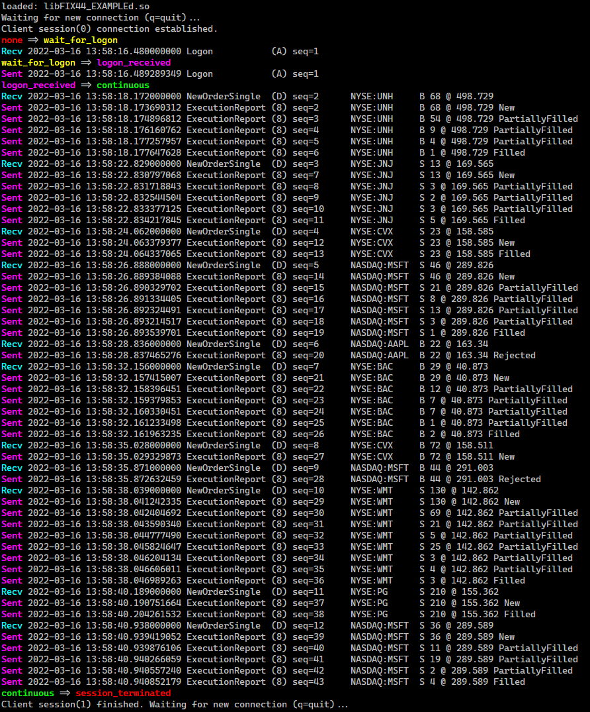
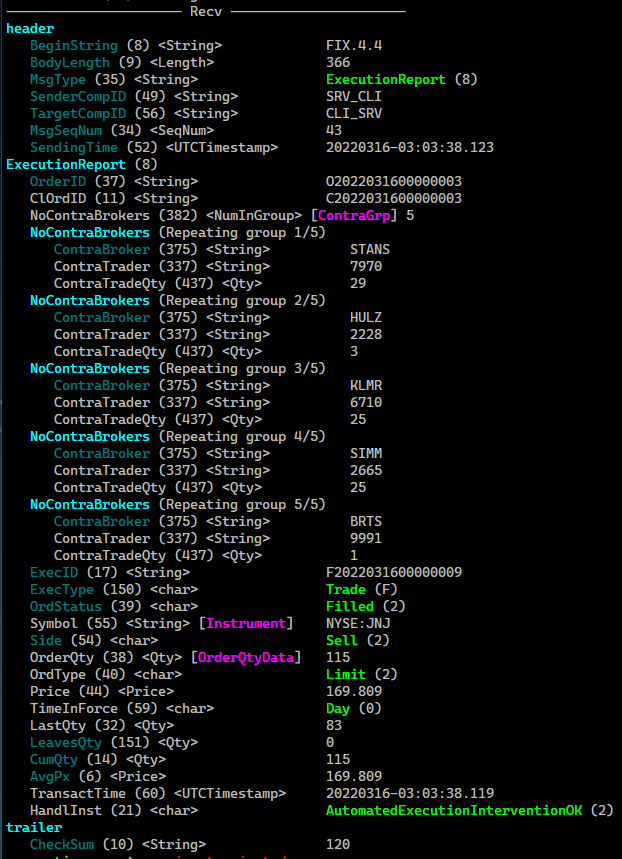
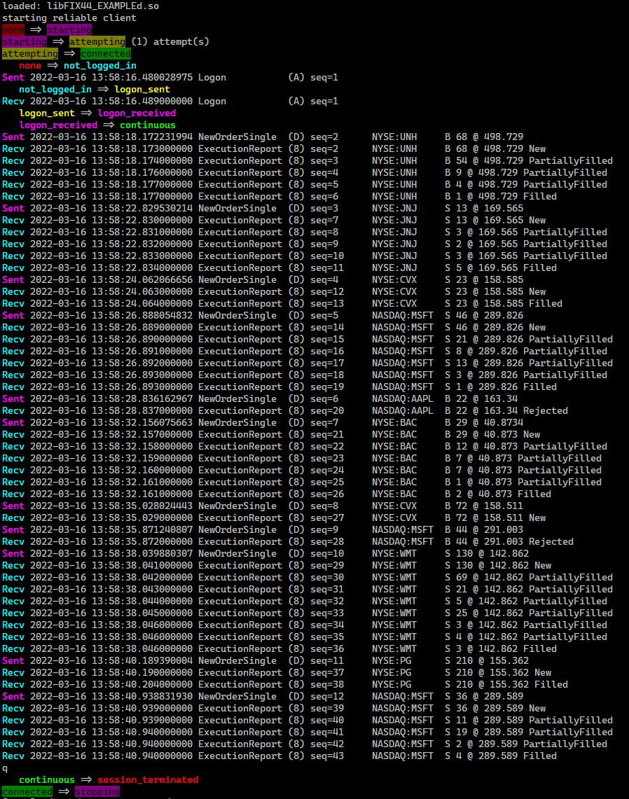
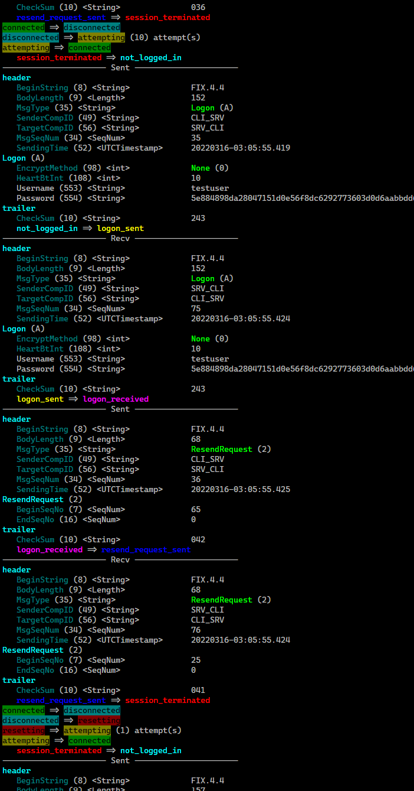
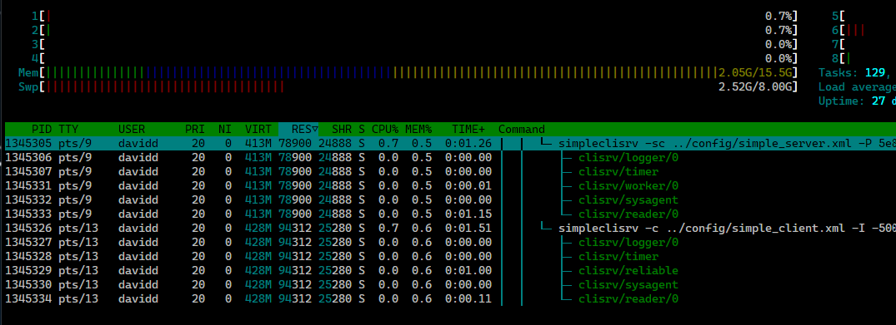

<p align="center">
  <a href="https://www.fix8mt.com"></a>
</p>

# Fix8Pro C++ example
#### An example client/server that can be used as a starting point for development using the Fix8Pro C++ Framework.

1.   [Introduction](#introduction)
2.   [To download](#to-download)
3.   [Before you build](#before-you-build)
4.   [To build](#to-build)
5.   [To setup your run environment](#to-setup-your-run-environment)
6.   [CLI options](#cli-options)
7.   [To run](#to-run)
8.   [Sample output](#sample-output)
      1.   [Server](#server)
      1.   [Client](#client)
      1.   [Misc](#misc)

------------------------------------------------------------------------
## Introduction
You have two main options when you develop a FIX application using Fix8Pro. For super high performance close to the metal, choose Fix8Pro C++ Framework (this example).
For high performance and rapid development using a range of modern languages, choose UFE.

The UFE package comes with freely available high performance UFEed© client adaptors. You can find full source code and instructions for all our UFEed adaptors (Python, Java, C# and C++)
on our [github repo](https://github.com/fix8mt/ufeed_bindings).

This brief example demonstrates how to create a client and a server that can listen and accept or initiate FIX sessions.

This example uses the standard FIX44 dictionary. It also uses high quality pseudo-random number generation classes provided by the C++ Standard Library, offering a model for creating simulations.

<kbd> 
  <p><i>Message displayed with the built-in Fix8Pro printer</i></p>
</kbd>

## To download
You can read about all the available releases [`here`](https://github.com/fix8mt/fix8pro_example/releases). There are two branches: [`master`](https://github.com/fix8mt/fix8pro_example) (stable version) and [`dev`](https://github.com/fix8mt/fix8pro_example/tree/dev) (latest cutting edge).

Optionally specify the `dev` branch when you clone:
```bash
git clone https://github.com/fix8mt/fix8pro_example.git [-b dev]
cd fix8pro_example
```

## Before you build
You will need the following to build this example:
1. A supported [`C++17`](https://en.wikipedia.org/wiki/C%2B%2B17) compiler and build environment
1. A Fix8Pro license from [`Fix8MT`](https://fix8mt.com/) (or an evaluation license)
1. An installed Fix8Pro binary package, minimum version **22.03**

## To build
For example assuming you have installed Fix8Pro to `/opt/fix8pro` and your license file is also in `/opt/fix8pro`:
```bash
mkdir build
cd build
cmake -DFIX8PRO_LICENSE_FILE=/opt/fix8pro/mylic.xml -DFIX8PRO_ROOT=/opt/fix8pro -DCMAKE_INSTALL_PREFIX=./ -DCMAKE_BUILD_TYPE=Release ..
make install
```

## To setup your run environment
1. Add your Fix8Pro binary and library installation directories to your `$PATH` and `$LD_LIBRARY_PATH`.
For example, if you installed Fix8Pro to `/opt/fix8pro`:
```bash
export PATH=$PATH:/opt/fix8pro/bin
export LD_LIBRARY_PATH=$LD_LIBRARY_PATH:/opt/fix8pro/lib
```
2. Set your `$FIX8PRO_LICENSE_FILE` environment variable.
For example, if your license file is in `/opt/fix8pro`:
```bash
export FIX8PRO_LICENSE_FILE=/opt/fix8pro/mylic.xml
```

## CLI options

<details><summary><i>These options are defined in </i><tt>Application::options_setup()</tt>. <i>Some of the options are added by </i><tt>Fix8ProApplication</tt>.</summary>
<p>

```bash
% ./simpleclisrv -h
Fix8Pro sample client/server
Usage:
  simpleclisrv [OPTION...]

  -c, --config arg         xml config (default: simple_client.xml or
                           simple_server.xml)
  -l, --log arg            global log filename (default:
                           ./run/client_%{DATE}_global.log or ./run/server_%{DATE}_global.log)
  -V, --serversession arg  name of server session profile in xml config to
                           use (default: SRV)
  -C, --clientsession arg  name of client session profile in xml config to
                           use (default: CLI)
  -q, --quiet              do not print fix output
  -R, --receive arg        set next expected receive sequence number
                           (default: 0)
  -S, --send arg           set next expected send sequence number (default:
                           0)
  -g, --giveupreset arg    number of reliable reconnects to try before
                           resetting seqnums (default: 10)
  -r, --reliable           start in reliable mode (default: true)
  -G, --generate           generate NewOrderSingle messages (client)
                           (default: true)
  -I, --interval arg       client generation interval (msecs); if -ve use
                           random interval between 0 and -(n) (default: 5000)
  -H, --showheartbeats     show inbound heartbeats (default: true)
  -L, --libpath arg        library path to load Fix8 schema object, default
                           path or LD_LIBRARY_PATH
  -T, --threadname arg     prefix thread names with given string
  -t, --states             show session and reliable session thread state
                           changes (default: true)
  -U, --username arg       FIX username used in logon (default: testuser)
  -P, --password arg       FIX password used in logon (cleartext) (default:
                           password)
  -u, --summary            run in summary display mode
  -k, --capture arg        capture all screen output to specified file
  -s, --server             run in server mode (default client mode)
  -D, --debug              debug mode

 info options:
  -h, --help          Help screen
  -v, --version       Version
  -0, --showcmdline   Show cmdline details
  -5, --environment   Show FIX8PRO environment variable help; show env vars
                      (debug mode)
  -6, --dependencies  Show shared library dependencies
  -7, --binaryreport  Show ABI, lib and binary info
  -8, --appinfo       Show application banner and info

 history options:
  -1, --history      Print command history; look in current directory or in
                     $FIX8PRO_CMD_HIST_DIR; use $FIX8PRO_CMD_HIST_SIZE to set
                     max history or 0 to turn off
  -2, --invoke arg   Invoke given command by index (use -ve from last)
  -3, --remove       Remove all history
  -4, --interactive  Interactve mode, select/edit using bash-like commands,
                     (? <enter> for help)

e.g.
simple cli/srv pair:
   simpleclisrv -c config/simple_server.xml -s
   simpleclisrv -c config/simple_client.xml
cli/srv pair with supplied hash pw, random generation interval (~1s), base thread named, run in summary mode:
   simpleclisrv -sc ../config/simple_server.xml -P 5e884898da28047151d0e56f8dc6292773603d0d6aabbdd62a11ef721d1542d8 -u -T clisrv
   simpleclisrv -c ../config/simple_client.xml  -I -1000 -P 5e884898da28047151d0e56f8dc6292773603d0d6aabbdd62a11ef721d1542d8 -u -T clisrv
```

</p>
</details>

## To run
This example has been designed to run as two instances - a client and a server. For simplicity we'll run the test from the `./build` directory.
In one terminal we'll run our server:
```bash
./simpleclisrv -c ../config/simple_server.xml -s
```
In our other terminal we'll run our client:
```bash
./simpleclisrv -c ../config/simple_client.xml
```
- When connected, the client will send a `NewOrderSingle` every 5 seconds. The server will simulate an order accept and trade, sending back an acknowledgment followed by a random number of fills (`ExecutionReport`s).
- From the client, press `l<enter>` to logout and shutdown, `q<enter>` to shutdown and `x<enter>` to just exit

## Sample output

### Server

<details>
<summary><i>Shows the server receiving a login, receiving NewOrderSingles and sending ExecutionReports.</i></summary>
<p>

```bash
% ./simpleclisrv -c ../config/simple_server.xml -s
loaded: libFIX44_EXAMPLEd.so
Waiting for new connection (q=quit)...
Client session(0) connection established.
none => wait_for_logon
---------------------- Recv ----------------------
header
   BeginString (8) <String>             FIX.4.4
   BodyLength (9) <Length>              151
   MsgType (35) <String>                Logon (A)
   SenderCompID (49) <String>           CLI_SRV
   TargetCompID (56) <String>           SRV_CLI
   MsgSeqNum (34) <SeqNum>              1
   SendingTime (52) <UTCTimestamp>      20220316-21:33:19.747
Logon (A)
   EncryptMethod (98) <int>             None (0)
   HeartBtInt (108) <int>               10
   Username (553) <String>              testuser
   Password (554) <String>              5e884898da28047151d0e56f8dc6292773603d0d6aabbdd62a11ef721d1542d8
trailer
   CheckSum (10) <String>               192
wait_for_logon => logon_received
---------------------- Sent ----------------------
header
   BeginString (8) <String>             FIX.4.4
   BodyLength (9) <Length>              151
   MsgType (35) <String>                Logon (A)
   SenderCompID (49) <String>           SRV_CLI
   TargetCompID (56) <String>           CLI_SRV
   MsgSeqNum (34) <SeqNum>              1
   SendingTime (52) <UTCTimestamp>      20220316-21:33:19.756
Logon (A)
   EncryptMethod (98) <int>             None (0)
   HeartBtInt (108) <int>               10
   Username (553) <String>              testuser
   Password (554) <String>              5e884898da28047151d0e56f8dc6292773603d0d6aabbdd62a11ef721d1542d8
trailer
   CheckSum (10) <String>               192
logon_received => continuous
---------------------- Recv ----------------------
header
   BeginString (8) <String>             FIX.4.4
   BodyLength (9) <Length>              151
   MsgType (35) <String>                NewOrderSingle (D)
   SenderCompID (49) <String>           CLI_SRV
   TargetCompID (56) <String>           SRV_CLI
   MsgSeqNum (34) <SeqNum>              2
   SendingTime (52) <UTCTimestamp>      20220316-21:33:22.247
NewOrderSingle (D)
   ClOrdID (11) <String>                C2022031700000001
   HandlInst (21) <char>                AutomatedExecutionNoIntervention (1)
   Symbol (55) <String> [Instrument]    NASDAQ:FB
   Side (54) <char>                     Sell (2)
   TransactTime (60) <UTCTimestamp>     20220316-21:33:22.247
   OrderQty (38) <Qty> [OrderQtyData]   9
   OrdType (40) <char>                  Limit (2)
   Price (44) <Price>                   200.14
   TimeInForce (59) <char>              AtTheOpening (2)
trailer
   CheckSum (10) <String>               100
---------------------- Sent ----------------------
header
   BeginString (8) <String>             FIX.4.4
   BodyLength (9) <Length>              224
   MsgType (35) <String>                ExecutionReport (8)
   SenderCompID (49) <String>           SRV_CLI
   TargetCompID (56) <String>           CLI_SRV
   MsgSeqNum (34) <SeqNum>              2
   SendingTime (52) <UTCTimestamp>      20220316-21:33:22.250
ExecutionReport (8)
   OrderID (37) <String>                O2022031700000001
   ClOrdID (11) <String>                C2022031700000001
   ExecID (17) <String>                 E2022031700000001
   ExecType (150) <char>                New (0)
   OrdStatus (39) <char>                New (0)
   Symbol (55) <String> [Instrument]    NASDAQ:FB
   Side (54) <char>                     Sell (2)
   OrderQty (38) <Qty> [OrderQtyData]   9
   OrdType (40) <char>                  Limit (2)
   Price (44) <Price>                   200.14
   TimeInForce (59) <char>              AtTheOpening (2)
   LastCapacity (29) <char>             Principal (4)
   LeavesQty (151) <Qty>                9
   CumQty (14) <Qty>                    0
   AvgPx (6) <Price>                    0
   TransactTime (60) <UTCTimestamp>     20220316-21:33:22.247
   HandlInst (21) <char>                AutomatedExecutionNoIntervention (1)
trailer
   CheckSum (10) <String>               153
---------------------- Sent ----------------------
header
   BeginString (8) <String>             FIX.4.4
   BodyLength (9) <Length>              284
   MsgType (35) <String>                ExecutionReport (8)
   SenderCompID (49) <String>           SRV_CLI
   TargetCompID (56) <String>           CLI_SRV
   MsgSeqNum (34) <SeqNum>              3
   SendingTime (52) <UTCTimestamp>      20220316-21:33:22.252
ExecutionReport (8)
   OrderID (37) <String>                O2022031700000001
   ClOrdID (11) <String>                C2022031700000001
   NoContraBrokers (382) <NumInGroup> [ContraGrp] 2
   NoContraBrokers (Repeating group 1/2)
      ContraBroker (375) <String>          STANS
      ContraTrader (337) <String>          6766
      ContraTradeQty (437) <Qty>           2
   NoContraBrokers (Repeating group 2/2)
      ContraBroker (375) <String>          SIMM
      ContraTrader (337) <String>          6112
      ContraTradeQty (437) <Qty>           2
   ExecID (17) <String>                 F2022031700000002
   ExecType (150) <char>                Trade (F)
   OrdStatus (39) <char>                PartiallyFilled (1)
   Symbol (55) <String> [Instrument]    NASDAQ:FB
   Side (54) <char>                     Sell (2)
   OrderQty (38) <Qty> [OrderQtyData]   9
   OrdType (40) <char>                  Limit (2)
   Price (44) <Price>                   200.14
   TimeInForce (59) <char>              AtTheOpening (2)
   LastQty (32) <Qty>                   4
   LeavesQty (151) <Qty>                5
   CumQty (14) <Qty>                    4
   AvgPx (6) <Price>                    200.14
   TransactTime (60) <UTCTimestamp>     20220316-21:33:22.247
   HandlInst (21) <char>                AutomatedExecutionNoIntervention (1)
trailer
   CheckSum (10) <String>               165
---------------------- Sent ----------------------
header
   BeginString (8) <String>             FIX.4.4
   BodyLength (9) <Length>              283
   MsgType (35) <String>                ExecutionReport (8)
   SenderCompID (49) <String>           SRV_CLI
   TargetCompID (56) <String>           CLI_SRV
   MsgSeqNum (34) <SeqNum>              4
   SendingTime (52) <UTCTimestamp>      20220316-21:33:22.253
ExecutionReport (8)
   OrderID (37) <String>                O2022031700000001
   ClOrdID (11) <String>                C2022031700000001
   NoContraBrokers (382) <NumInGroup> [ContraGrp] 2
   NoContraBrokers (Repeating group 1/2)
      ContraBroker (375) <String>          AVR1
      ContraTrader (337) <String>          6680
      ContraTradeQty (437) <Qty>           1
   NoContraBrokers (Repeating group 2/2)
      ContraBroker (375) <String>          HULZ
      ContraTrader (337) <String>          9436
      ContraTradeQty (437) <Qty>           1
   ExecID (17) <String>                 F2022031700000003
   ExecType (150) <char>                Trade (F)
   OrdStatus (39) <char>                PartiallyFilled (1)
   Symbol (55) <String> [Instrument]    NASDAQ:FB
   Side (54) <char>                     Sell (2)
   OrderQty (38) <Qty> [OrderQtyData]   9
   OrdType (40) <char>                  Limit (2)
   Price (44) <Price>                   200.14
   TimeInForce (59) <char>              AtTheOpening (2)
   LastQty (32) <Qty>                   2
   LeavesQty (151) <Qty>                3
   CumQty (14) <Qty>                    6
   AvgPx (6) <Price>                    200.14
   TransactTime (60) <UTCTimestamp>     20220316-21:33:22.247
   HandlInst (21) <char>                AutomatedExecutionNoIntervention (1)
trailer
   CheckSum (10) <String>               072
---------------------- Sent ----------------------
header
   BeginString (8) <String>             FIX.4.4
   BodyLength (9) <Length>              283
   MsgType (35) <String>                ExecutionReport (8)
   SenderCompID (49) <String>           SRV_CLI
   TargetCompID (56) <String>           CLI_SRV
   MsgSeqNum (34) <SeqNum>              5
   SendingTime (52) <UTCTimestamp>      20220316-21:33:22.254
ExecutionReport (8)
   OrderID (37) <String>                O2022031700000001
   ClOrdID (11) <String>                C2022031700000001
   NoContraBrokers (382) <NumInGroup> [ContraGrp] 2
   NoContraBrokers (Repeating group 1/2)
      ContraBroker (375) <String>          BRTS
      ContraTrader (337) <String>          9800
      ContraTradeQty (437) <Qty>           1
   NoContraBrokers (Repeating group 2/2)
      ContraBroker (375) <String>          HULV
      ContraTrader (337) <String>          4574
      ContraTradeQty (437) <Qty>           1
   ExecID (17) <String>                 F2022031700000004
   ExecType (150) <char>                Trade (F)
   OrdStatus (39) <char>                PartiallyFilled (1)
   Symbol (55) <String> [Instrument]    NASDAQ:FB
   Side (54) <char>                     Sell (2)
   OrderQty (38) <Qty> [OrderQtyData]   9
   OrdType (40) <char>                  Limit (2)
   Price (44) <Price>                   200.14
   TimeInForce (59) <char>              AtTheOpening (2)
   LastQty (32) <Qty>                   2
   LeavesQty (151) <Qty>                1
   CumQty (14) <Qty>                    8
   AvgPx (6) <Price>                    200.14
   TransactTime (60) <UTCTimestamp>     20220316-21:33:22.247
   HandlInst (21) <char>                AutomatedExecutionNoIntervention (1)
trailer
   CheckSum (10) <String>               099
---------------------- Sent ----------------------
header
   BeginString (8) <String>             FIX.4.4
   BodyLength (9) <Length>              259
   MsgType (35) <String>                ExecutionReport (8)
   SenderCompID (49) <String>           SRV_CLI
   TargetCompID (56) <String>           CLI_SRV
   MsgSeqNum (34) <SeqNum>              6
   SendingTime (52) <UTCTimestamp>      20220316-21:33:22.255
ExecutionReport (8)
   OrderID (37) <String>                O2022031700000001
   ClOrdID (11) <String>                C2022031700000001
   NoContraBrokers (382) <NumInGroup> [ContraGrp] 1
   NoContraBrokers (Repeating group 1/1)
      ContraBroker (375) <String>          CAMS
      ContraTrader (337) <String>          6373
      ContraTradeQty (437) <Qty>           1
   ExecID (17) <String>                 F2022031700000005
   ExecType (150) <char>                Trade (F)
   OrdStatus (39) <char>                Filled (2)
   Symbol (55) <String> [Instrument]    NASDAQ:FB
   Side (54) <char>                     Sell (2)
   OrderQty (38) <Qty> [OrderQtyData]   9
   OrdType (40) <char>                  Limit (2)
   Price (44) <Price>                   200.14
   TimeInForce (59) <char>              AtTheOpening (2)
   LastQty (32) <Qty>                   1
   LeavesQty (151) <Qty>                0
   CumQty (14) <Qty>                    9
   AvgPx (6) <Price>                    200.14
   TransactTime (60) <UTCTimestamp>     20220316-21:33:22.247
   HandlInst (21) <char>                AutomatedExecutionNoIntervention (1)
trailer
   CheckSum (10) <String>               123
---------------------- Recv ----------------------
header
   BeginString (8) <String>             FIX.4.4
   BodyLength (9) <Length>              151
   MsgType (35) <String>                NewOrderSingle (D)
   SenderCompID (49) <String>           CLI_SRV
   TargetCompID (56) <String>           SRV_CLI
   MsgSeqNum (34) <SeqNum>              3
   SendingTime (52) <UTCTimestamp>      20220316-21:33:23.716
NewOrderSingle (D)
   ClOrdID (11) <String>                C2022031700000002
   HandlInst (21) <char>                ManualOrder (3)
   Symbol (55) <String> [Instrument]    NYSE:XOM
   Side (54) <char>                     Sell (2)
   TransactTime (60) <UTCTimestamp>     20220316-21:33:23.716
   OrderQty (38) <Qty> [OrderQtyData]   82
   OrdType (40) <char>                  Limit (2)
   Price (44) <Price>                   83.397
   TimeInForce (59) <char>              GoodTillCancel (1)
trailer
   CheckSum (10) <String>               166
---------------------- Sent ----------------------
header
   BeginString (8) <String>             FIX.4.4
   BodyLength (9) <Length>              225
   MsgType (35) <String>                ExecutionReport (8)
   SenderCompID (49) <String>           SRV_CLI
   TargetCompID (56) <String>           CLI_SRV
   MsgSeqNum (34) <SeqNum>              7
   SendingTime (52) <UTCTimestamp>      20220316-21:33:23.718
ExecutionReport (8)
   OrderID (37) <String>                O2022031700000002
   ClOrdID (11) <String>                C2022031700000002
   ExecID (17) <String>                 E2022031700000006
   ExecType (150) <char>                New (0)
   OrdStatus (39) <char>                New (0)
   Symbol (55) <String> [Instrument]    NYSE:XOM
   Side (54) <char>                     Sell (2)
   OrderQty (38) <Qty> [OrderQtyData]   82
   OrdType (40) <char>                  Limit (2)
   Price (44) <Price>                   83.397
   TimeInForce (59) <char>              GoodTillCancel (1)
   LastCapacity (29) <char>             Principal (4)
   LeavesQty (151) <Qty>                82
   CumQty (14) <Qty>                    0
   AvgPx (6) <Price>                    0
   TransactTime (60) <UTCTimestamp>     20220316-21:33:23.716
   HandlInst (21) <char>                ManualOrder (3)
trailer
   CheckSum (10) <String>               031
---------------------- Sent ----------------------
header
   BeginString (8) <String>             FIX.4.4
   BodyLength (9) <Length>              313
   MsgType (35) <String>                ExecutionReport (8)
   SenderCompID (49) <String>           SRV_CLI
   TargetCompID (56) <String>           CLI_SRV
   MsgSeqNum (34) <SeqNum>              8
   SendingTime (52) <UTCTimestamp>      20220316-21:33:23.721
ExecutionReport (8)
   OrderID (37) <String>                O2022031700000002
   ClOrdID (11) <String>                C2022031700000002
   NoContraBrokers (382) <NumInGroup> [ContraGrp] 3
   NoContraBrokers (Repeating group 1/3)
      ContraBroker (375) <String>          NYVY
      ContraTrader (337) <String>          6506
      ContraTradeQty (437) <Qty>           12
   NoContraBrokers (Repeating group 2/3)
      ContraBroker (375) <String>          STANS
      ContraTrader (337) <String>          7178
      ContraTradeQty (437) <Qty>           17
   NoContraBrokers (Repeating group 3/3)
      ContraBroker (375) <String>          SIMM
      ContraTrader (337) <String>          8836
      ContraTradeQty (437) <Qty>           1
   ExecID (17) <String>                 F2022031700000007
   ExecType (150) <char>                Trade (F)
   OrdStatus (39) <char>                PartiallyFilled (1)
   Symbol (55) <String> [Instrument]    NYSE:XOM
   Side (54) <char>                     Sell (2)
   OrderQty (38) <Qty> [OrderQtyData]   82
   OrdType (40) <char>                  Limit (2)
   Price (44) <Price>                   83.397
   TimeInForce (59) <char>              GoodTillCancel (1)
   LastQty (32) <Qty>                   30
   LeavesQty (151) <Qty>                52
   CumQty (14) <Qty>                    30
   AvgPx (6) <Price>                    83.397
   TransactTime (60) <UTCTimestamp>     20220316-21:33:23.716
   HandlInst (21) <char>                ManualOrder (3)
trailer
   CheckSum (10) <String>               242
---------------------- Sent ----------------------
header
   BeginString (8) <String>             FIX.4.4
   BodyLength (9) <Length>              360
   MsgType (35) <String>                ExecutionReport (8)
   SenderCompID (49) <String>           SRV_CLI
   TargetCompID (56) <String>           CLI_SRV
   MsgSeqNum (34) <SeqNum>              9
   SendingTime (52) <UTCTimestamp>      20220316-21:33:23.722
ExecutionReport (8)
   OrderID (37) <String>                O2022031700000002
   ClOrdID (11) <String>                C2022031700000002
   NoContraBrokers (382) <NumInGroup> [ContraGrp] 5
   NoContraBrokers (Repeating group 1/5)
      ContraBroker (375) <String>          ORTA
      ContraTrader (337) <String>          8990
      ContraTradeQty (437) <Qty>           11
   NoContraBrokers (Repeating group 2/5)
      ContraBroker (375) <String>          STANS
      ContraTrader (337) <String>          4305
      ContraTradeQty (437) <Qty>           2
   NoContraBrokers (Repeating group 3/5)
      ContraBroker (375) <String>          SIMM
      ContraTrader (337) <String>          5673
      ContraTradeQty (437) <Qty>           2
   NoContraBrokers (Repeating group 4/5)
      ContraBroker (375) <String>          AVR2
      ContraTrader (337) <String>          4569
      ContraTradeQty (437) <Qty>           7
   NoContraBrokers (Repeating group 5/5)
      ContraBroker (375) <String>          NXPR
      ContraTrader (337) <String>          5420
      ContraTradeQty (437) <Qty>           2
   ExecID (17) <String>                 F2022031700000008
   ExecType (150) <char>                Trade (F)
   OrdStatus (39) <char>                PartiallyFilled (1)
   Symbol (55) <String> [Instrument]    NYSE:XOM
   Side (54) <char>                     Sell (2)
   OrderQty (38) <Qty> [OrderQtyData]   82
   OrdType (40) <char>                  Limit (2)
   Price (44) <Price>                   83.397
   TimeInForce (59) <char>              GoodTillCancel (1)
   LastQty (32) <Qty>                   24
   LeavesQty (151) <Qty>                28
   CumQty (14) <Qty>                    54
   AvgPx (6) <Price>                    83.397
   TransactTime (60) <UTCTimestamp>     20220316-21:33:23.716
   HandlInst (21) <char>                ManualOrder (3)
trailer
   CheckSum (10) <String>               064
---------------------- Sent ----------------------
header
   BeginString (8) <String>             FIX.4.4
   BodyLength (9) <Length>              360
   MsgType (35) <String>                ExecutionReport (8)
   SenderCompID (49) <String>           SRV_CLI
   TargetCompID (56) <String>           CLI_SRV
   MsgSeqNum (34) <SeqNum>              10
   SendingTime (52) <UTCTimestamp>      20220316-21:33:23.724
ExecutionReport (8)
   OrderID (37) <String>                O2022031700000002
   ClOrdID (11) <String>                C2022031700000002
   NoContraBrokers (382) <NumInGroup> [ContraGrp] 5
   NoContraBrokers (Repeating group 1/5)
      ContraBroker (375) <String>          AVR2
      ContraTrader (337) <String>          3406
      ContraTradeQty (437) <Qty>           2
   NoContraBrokers (Repeating group 2/5)
      ContraBroker (375) <String>          CAMS
      ContraTrader (337) <String>          9685
      ContraTradeQty (437) <Qty>           11
   NoContraBrokers (Repeating group 3/5)
      ContraBroker (375) <String>          KLMR
      ContraTrader (337) <String>          9709
      ContraTradeQty (437) <Qty>           1
   NoContraBrokers (Repeating group 4/5)
      ContraBroker (375) <String>          NYVY
      ContraTrader (337) <String>          9087
      ContraTradeQty (437) <Qty>           1
   NoContraBrokers (Repeating group 5/5)
      ContraBroker (375) <String>          AVR2
      ContraTrader (337) <String>          1591
      ContraTradeQty (437) <Qty>           1
   ExecID (17) <String>                 F2022031700000009
   ExecType (150) <char>                Trade (F)
   OrdStatus (39) <char>                PartiallyFilled (1)
   Symbol (55) <String> [Instrument]    NYSE:XOM
   Side (54) <char>                     Sell (2)
   OrderQty (38) <Qty> [OrderQtyData]   82
   OrdType (40) <char>                  Limit (2)
   Price (44) <Price>                   83.397
   TimeInForce (59) <char>              GoodTillCancel (1)
   LastQty (32) <Qty>                   16
   LeavesQty (151) <Qty>                12
   CumQty (14) <Qty>                    70
   AvgPx (6) <Price>                    83.397
   TransactTime (60) <UTCTimestamp>     20220316-21:33:23.716
   HandlInst (21) <char>                ManualOrder (3)
trailer
   CheckSum (10) <String>               245
---------------------- Sent ----------------------
header
   BeginString (8) <String>             FIX.4.4
   BodyLength (9) <Length>              309
   MsgType (35) <String>                ExecutionReport (8)
   SenderCompID (49) <String>           SRV_CLI
   TargetCompID (56) <String>           CLI_SRV
   MsgSeqNum (34) <SeqNum>              11
   SendingTime (52) <UTCTimestamp>      20220316-21:33:23.725
ExecutionReport (8)
   OrderID (37) <String>                O2022031700000002
   ClOrdID (11) <String>                C2022031700000002
   NoContraBrokers (382) <NumInGroup> [ContraGrp] 3
   NoContraBrokers (Repeating group 1/3)
      ContraBroker (375) <String>          BRTS
      ContraTrader (337) <String>          1747
      ContraTradeQty (437) <Qty>           2
   NoContraBrokers (Repeating group 2/3)
      ContraBroker (375) <String>          HULV
      ContraTrader (337) <String>          1693
      ContraTradeQty (437) <Qty>           2
   NoContraBrokers (Repeating group 3/3)
      ContraBroker (375) <String>          AVR2
      ContraTrader (337) <String>          9667
      ContraTradeQty (437) <Qty>           2
   ExecID (17) <String>                 F2022031700000010
   ExecType (150) <char>                Trade (F)
   OrdStatus (39) <char>                PartiallyFilled (1)
   Symbol (55) <String> [Instrument]    NYSE:XOM
   Side (54) <char>                     Sell (2)
   OrderQty (38) <Qty> [OrderQtyData]   82
   OrdType (40) <char>                  Limit (2)
   Price (44) <Price>                   83.397
   TimeInForce (59) <char>              GoodTillCancel (1)
   LastQty (32) <Qty>                   6
   LeavesQty (151) <Qty>                6
   CumQty (14) <Qty>                    76
   AvgPx (6) <Price>                    83.397
   TransactTime (60) <UTCTimestamp>     20220316-21:33:23.716
   HandlInst (21) <char>                ManualOrder (3)
trailer
   CheckSum (10) <String>               230
---------------------- Sent ----------------------
header
   BeginString (8) <String>             FIX.4.4
   BodyLength (9) <Length>              285
   MsgType (35) <String>                ExecutionReport (8)
   SenderCompID (49) <String>           SRV_CLI
   TargetCompID (56) <String>           CLI_SRV
   MsgSeqNum (34) <SeqNum>              12
   SendingTime (52) <UTCTimestamp>      20220316-21:33:23.726
ExecutionReport (8)
   OrderID (37) <String>                O2022031700000002
   ClOrdID (11) <String>                C2022031700000002
   NoContraBrokers (382) <NumInGroup> [ContraGrp] 2
   NoContraBrokers (Repeating group 1/2)
      ContraBroker (375) <String>          HULV
      ContraTrader (337) <String>          6258
      ContraTradeQty (437) <Qty>           1
   NoContraBrokers (Repeating group 2/2)
      ContraBroker (375) <String>          NXPR
      ContraTrader (337) <String>          5231
      ContraTradeQty (437) <Qty>           1
   ExecID (17) <String>                 F2022031700000011
   ExecType (150) <char>                Trade (F)
   OrdStatus (39) <char>                PartiallyFilled (1)
   Symbol (55) <String> [Instrument]    NYSE:XOM
   Side (54) <char>                     Sell (2)
   OrderQty (38) <Qty> [OrderQtyData]   82
   OrdType (40) <char>                  Limit (2)
   Price (44) <Price>                   83.397
   TimeInForce (59) <char>              GoodTillCancel (1)
   LastQty (32) <Qty>                   2
   LeavesQty (151) <Qty>                4
   CumQty (14) <Qty>                    78
   AvgPx (6) <Price>                    83.397
   TransactTime (60) <UTCTimestamp>     20220316-21:33:23.716
   HandlInst (21) <char>                ManualOrder (3)
trailer
   CheckSum (10) <String>               047
---------------------- Sent ----------------------
header
   BeginString (8) <String>             FIX.4.4
   BodyLength (9) <Length>              285
   MsgType (35) <String>                ExecutionReport (8)
   SenderCompID (49) <String>           SRV_CLI
   TargetCompID (56) <String>           CLI_SRV
   MsgSeqNum (34) <SeqNum>              13
   SendingTime (52) <UTCTimestamp>      20220316-21:33:23.727
ExecutionReport (8)
   OrderID (37) <String>                O2022031700000002
   ClOrdID (11) <String>                C2022031700000002
   NoContraBrokers (382) <NumInGroup> [ContraGrp] 2
   NoContraBrokers (Repeating group 1/2)
      ContraBroker (375) <String>          NXPR
      ContraTrader (337) <String>          4452
      ContraTradeQty (437) <Qty>           1
   NoContraBrokers (Repeating group 2/2)
      ContraBroker (375) <String>          KLMR
      ContraTrader (337) <String>          5749
      ContraTradeQty (437) <Qty>           1
   ExecID (17) <String>                 F2022031700000012
   ExecType (150) <char>                Trade (F)
   OrdStatus (39) <char>                PartiallyFilled (1)
   Symbol (55) <String> [Instrument]    NYSE:XOM
   Side (54) <char>                     Sell (2)
   OrderQty (38) <Qty> [OrderQtyData]   82
   OrdType (40) <char>                  Limit (2)
   Price (44) <Price>                   83.397
   TimeInForce (59) <char>              GoodTillCancel (1)
   LastQty (32) <Qty>                   2
   LeavesQty (151) <Qty>                2
   CumQty (14) <Qty>                    80
   AvgPx (6) <Price>                    83.397
   TransactTime (60) <UTCTimestamp>     20220316-21:33:23.716
   HandlInst (21) <char>                ManualOrder (3)
trailer
   CheckSum (10) <String>               040
---------------------- Sent ----------------------
header
   BeginString (8) <String>             FIX.4.4
   BodyLength (9) <Length>              285
   MsgType (35) <String>                ExecutionReport (8)
   SenderCompID (49) <String>           SRV_CLI
   TargetCompID (56) <String>           CLI_SRV
   MsgSeqNum (34) <SeqNum>              14
   SendingTime (52) <UTCTimestamp>      20220316-21:33:23.728
ExecutionReport (8)
   OrderID (37) <String>                O2022031700000002
   ClOrdID (11) <String>                C2022031700000002
   NoContraBrokers (382) <NumInGroup> [ContraGrp] 2
   NoContraBrokers (Repeating group 1/2)
      ContraBroker (375) <String>          BRTS
      ContraTrader (337) <String>          2095
      ContraTradeQty (437) <Qty>           1
   NoContraBrokers (Repeating group 2/2)
      ContraBroker (375) <String>          CAMS
      ContraTrader (337) <String>          8074
      ContraTradeQty (437) <Qty>           1
   ExecID (17) <String>                 F2022031700000013
   ExecType (150) <char>                Trade (F)
   OrdStatus (39) <char>                Filled (2)
   Symbol (55) <String> [Instrument]    NYSE:XOM
   Side (54) <char>                     Sell (2)
   OrderQty (38) <Qty> [OrderQtyData]   82
   OrdType (40) <char>                  Limit (2)
   Price (44) <Price>                   83.397
   TimeInForce (59) <char>              GoodTillCancel (1)
   LastQty (32) <Qty>                   2
   LeavesQty (151) <Qty>                0
   CumQty (14) <Qty>                    82
   AvgPx (6) <Price>                    83.397
   TransactTime (60) <UTCTimestamp>     20220316-21:33:23.716
   HandlInst (21) <char>                ManualOrder (3)
trailer
   CheckSum (10) <String>               008
---------------------- Recv ----------------------
header
   BeginString (8) <String>             FIX.4.4
   BodyLength (9) <Length>              153
   MsgType (35) <String>                NewOrderSingle (D)
   SenderCompID (49) <String>           CLI_SRV
   TargetCompID (56) <String>           SRV_CLI
   MsgSeqNum (34) <SeqNum>              4
   SendingTime (52) <UTCTimestamp>      20220316-21:33:24.369
NewOrderSingle (D)
   ClOrdID (11) <String>                C2022031700000003
   HandlInst (21) <char>                AutomatedExecutionInterventionOK (2)
   Symbol (55) <String> [Instrument]    NYSE:WMT
   Side (54) <char>                     Sell (2)
   TransactTime (60) <UTCTimestamp>     20220316-21:33:24.369
   OrderQty (38) <Qty> [OrderQtyData]   219
   OrdType (40) <char>                  Limit (2)
   Price (44) <Price>                   142.521
   TimeInForce (59) <char>              ImmediateOrCancel (3)
trailer
   CheckSum (10) <String>               012
---------------------- Sent ----------------------
header
   BeginString (8) <String>             FIX.4.4
   BodyLength (9) <Length>              229
   MsgType (35) <String>                ExecutionReport (8)
   SenderCompID (49) <String>           SRV_CLI
   TargetCompID (56) <String>           CLI_SRV
   MsgSeqNum (34) <SeqNum>              15
   SendingTime (52) <UTCTimestamp>      20220316-21:33:24.371
ExecutionReport (8)
   OrderID (37) <String>                O2022031700000003
   ClOrdID (11) <String>                C2022031700000003
   ExecID (17) <String>                 E2022031700000014
   ExecType (150) <char>                New (0)
   OrdStatus (39) <char>                New (0)
   Symbol (55) <String> [Instrument]    NYSE:WMT
   Side (54) <char>                     Sell (2)
   OrderQty (38) <Qty> [OrderQtyData]   219
   OrdType (40) <char>                  Limit (2)
   Price (44) <Price>                   142.521
   TimeInForce (59) <char>              ImmediateOrCancel (3)
   LastCapacity (29) <char>             Principal (4)
   LeavesQty (151) <Qty>                219
   CumQty (14) <Qty>                    0
   AvgPx (6) <Price>                    0
   TransactTime (60) <UTCTimestamp>     20220316-21:33:24.369
   HandlInst (21) <char>                AutomatedExecutionInterventionOK (2)
trailer
   CheckSum (10) <String>               222
---------------------- Sent ----------------------
header
   BeginString (8) <String>             FIX.4.4
   BodyLength (9) <Length>              319
   MsgType (35) <String>                ExecutionReport (8)
   SenderCompID (49) <String>           SRV_CLI
   TargetCompID (56) <String>           CLI_SRV
   MsgSeqNum (34) <SeqNum>              16
   SendingTime (52) <UTCTimestamp>      20220316-21:33:24.374
ExecutionReport (8)
   OrderID (37) <String>                O2022031700000003
   ClOrdID (11) <String>                C2022031700000003
   NoContraBrokers (382) <NumInGroup> [ContraGrp] 3
   NoContraBrokers (Repeating group 1/3)
      ContraBroker (375) <String>          KLMR
      ContraTrader (337) <String>          9289
      ContraTradeQty (437) <Qty>           19
   NoContraBrokers (Repeating group 2/3)
      ContraBroker (375) <String>          AVR2
      ContraTrader (337) <String>          1891
      ContraTradeQty (437) <Qty>           160
   NoContraBrokers (Repeating group 3/3)
      ContraBroker (375) <String>          AVR1
      ContraTrader (337) <String>          3676
      ContraTradeQty (437) <Qty>           5
   ExecID (17) <String>                 F2022031700000015
   ExecType (150) <char>                Trade (F)
   OrdStatus (39) <char>                PartiallyFilled (1)
   Symbol (55) <String> [Instrument]    NYSE:WMT
   Side (54) <char>                     Sell (2)
   OrderQty (38) <Qty> [OrderQtyData]   219
   OrdType (40) <char>                  Limit (2)
   Price (44) <Price>                   142.521
   TimeInForce (59) <char>              ImmediateOrCancel (3)
   LastQty (32) <Qty>                   184
   LeavesQty (151) <Qty>                35
   CumQty (14) <Qty>                    184
   AvgPx (6) <Price>                    142.521
   TransactTime (60) <UTCTimestamp>     20220316-21:33:24.369
   HandlInst (21) <char>                AutomatedExecutionInterventionOK (2)
trailer
   CheckSum (10) <String>               180
---------------------- Sent ----------------------
header
   BeginString (8) <String>             FIX.4.4
   BodyLength (9) <Length>              292
   MsgType (35) <String>                ExecutionReport (8)
   SenderCompID (49) <String>           SRV_CLI
   TargetCompID (56) <String>           CLI_SRV
   MsgSeqNum (34) <SeqNum>              17
   SendingTime (52) <UTCTimestamp>      20220316-21:33:24.376
ExecutionReport (8)
   OrderID (37) <String>                O2022031700000003
   ClOrdID (11) <String>                C2022031700000003
   NoContraBrokers (382) <NumInGroup> [ContraGrp] 2
   NoContraBrokers (Repeating group 1/2)
      ContraBroker (375) <String>          SIMM
      ContraTrader (337) <String>          5680
      ContraTradeQty (437) <Qty>           10
   NoContraBrokers (Repeating group 2/2)
      ContraBroker (375) <String>          SIMM
      ContraTrader (337) <String>          9813
      ContraTradeQty (437) <Qty>           1
   ExecID (17) <String>                 F2022031700000016
   ExecType (150) <char>                Trade (F)
   OrdStatus (39) <char>                PartiallyFilled (1)
   Symbol (55) <String> [Instrument]    NYSE:WMT
   Side (54) <char>                     Sell (2)
   OrderQty (38) <Qty> [OrderQtyData]   219
   OrdType (40) <char>                  Limit (2)
   Price (44) <Price>                   142.521
   TimeInForce (59) <char>              ImmediateOrCancel (3)
   LastQty (32) <Qty>                   11
   LeavesQty (151) <Qty>                24
   CumQty (14) <Qty>                    195
   AvgPx (6) <Price>                    142.521
   TransactTime (60) <UTCTimestamp>     20220316-21:33:24.369
   HandlInst (21) <char>                AutomatedExecutionInterventionOK (2)
trailer
   CheckSum (10) <String>               104
---------------------- Sent ----------------------
header
   BeginString (8) <String>             FIX.4.4
   BodyLength (9) <Length>              314
   MsgType (35) <String>                ExecutionReport (8)
   SenderCompID (49) <String>           SRV_CLI
   TargetCompID (56) <String>           CLI_SRV
   MsgSeqNum (34) <SeqNum>              18
   SendingTime (52) <UTCTimestamp>      20220316-21:33:24.377
ExecutionReport (8)
   OrderID (37) <String>                O2022031700000003
   ClOrdID (11) <String>                C2022031700000003
   NoContraBrokers (382) <NumInGroup> [ContraGrp] 3
   NoContraBrokers (Repeating group 1/3)
      ContraBroker (375) <String>          SIMM
      ContraTrader (337) <String>          3298
      ContraTradeQty (437) <Qty>           1
   NoContraBrokers (Repeating group 2/3)
      ContraBroker (375) <String>          AVR1
      ContraTrader (337) <String>          4412
      ContraTradeQty (437) <Qty>           2
   NoContraBrokers (Repeating group 3/3)
      ContraBroker (375) <String>          HULV
      ContraTrader (337) <String>          1654
      ContraTradeQty (437) <Qty>           2
   ExecID (17) <String>                 F2022031700000017
   ExecType (150) <char>                Trade (F)
   OrdStatus (39) <char>                PartiallyFilled (1)
   Symbol (55) <String> [Instrument]    NYSE:WMT
   Side (54) <char>                     Sell (2)
   OrderQty (38) <Qty> [OrderQtyData]   219
   OrdType (40) <char>                  Limit (2)
   Price (44) <Price>                   142.521
   TimeInForce (59) <char>              ImmediateOrCancel (3)
   LastQty (32) <Qty>                   5
   LeavesQty (151) <Qty>                19
   CumQty (14) <Qty>                    200
   AvgPx (6) <Price>                    142.521
   TransactTime (60) <UTCTimestamp>     20220316-21:33:24.369
   HandlInst (21) <char>                AutomatedExecutionInterventionOK (2)
trailer
   CheckSum (10) <String>               180
---------------------- Sent ----------------------
header
   BeginString (8) <String>             FIX.4.4
   BodyLength (9) <Length>              314
   MsgType (35) <String>                ExecutionReport (8)
   SenderCompID (49) <String>           SRV_CLI
   TargetCompID (56) <String>           CLI_SRV
   MsgSeqNum (34) <SeqNum>              19
   SendingTime (52) <UTCTimestamp>      20220316-21:33:24.378
ExecutionReport (8)
   OrderID (37) <String>                O2022031700000003
   ClOrdID (11) <String>                C2022031700000003
   NoContraBrokers (382) <NumInGroup> [ContraGrp] 3
   NoContraBrokers (Repeating group 1/3)
      ContraBroker (375) <String>          HULZ
      ContraTrader (337) <String>          6923
      ContraTradeQty (437) <Qty>           7
   NoContraBrokers (Repeating group 2/3)
      ContraBroker (375) <String>          KLMR
      ContraTrader (337) <String>          6374
      ContraTradeQty (437) <Qty>           5
   NoContraBrokers (Repeating group 3/3)
      ContraBroker (375) <String>          KLMR
      ContraTrader (337) <String>          4693
      ContraTradeQty (437) <Qty>           1
   ExecID (17) <String>                 F2022031700000018
   ExecType (150) <char>                Trade (F)
   OrdStatus (39) <char>                PartiallyFilled (1)
   Symbol (55) <String> [Instrument]    NYSE:WMT
   Side (54) <char>                     Sell (2)
   OrderQty (38) <Qty> [OrderQtyData]   219
   OrdType (40) <char>                  Limit (2)
   Price (44) <Price>                   142.521
   TimeInForce (59) <char>              ImmediateOrCancel (3)
   LastQty (32) <Qty>                   13
   LeavesQty (151) <Qty>                6
   CumQty (14) <Qty>                    213
   AvgPx (6) <Price>                    142.521
   TransactTime (60) <UTCTimestamp>     20220316-21:33:24.369
   HandlInst (21) <char>                AutomatedExecutionInterventionOK (2)
trailer
   CheckSum (10) <String>               235
---------------------- Sent ----------------------
header
   BeginString (8) <String>             FIX.4.4
   BodyLength (9) <Length>              313
   MsgType (35) <String>                ExecutionReport (8)
   SenderCompID (49) <String>           SRV_CLI
   TargetCompID (56) <String>           CLI_SRV
   MsgSeqNum (34) <SeqNum>              20
   SendingTime (52) <UTCTimestamp>      20220316-21:33:24.379
ExecutionReport (8)
   OrderID (37) <String>                O2022031700000003
   ClOrdID (11) <String>                C2022031700000003
   NoContraBrokers (382) <NumInGroup> [ContraGrp] 3
   NoContraBrokers (Repeating group 1/3)
      ContraBroker (375) <String>          ORTA
      ContraTrader (337) <String>          6208
      ContraTradeQty (437) <Qty>           1
   NoContraBrokers (Repeating group 2/3)
      ContraBroker (375) <String>          NYVY
      ContraTrader (337) <String>          6919
      ContraTradeQty (437) <Qty>           2
   NoContraBrokers (Repeating group 3/3)
      ContraBroker (375) <String>          CAMS
      ContraTrader (337) <String>          4035
      ContraTradeQty (437) <Qty>           1
   ExecID (17) <String>                 F2022031700000019
   ExecType (150) <char>                Trade (F)
   OrdStatus (39) <char>                PartiallyFilled (1)
   Symbol (55) <String> [Instrument]    NYSE:WMT
   Side (54) <char>                     Sell (2)
   OrderQty (38) <Qty> [OrderQtyData]   219
   OrdType (40) <char>                  Limit (2)
   Price (44) <Price>                   142.521
   TimeInForce (59) <char>              ImmediateOrCancel (3)
   LastQty (32) <Qty>                   4
   LeavesQty (151) <Qty>                2
   CumQty (14) <Qty>                    217
   AvgPx (6) <Price>                    142.521
   TransactTime (60) <UTCTimestamp>     20220316-21:33:24.369
   HandlInst (21) <char>                AutomatedExecutionInterventionOK (2)
trailer
   CheckSum (10) <String>               163
---------------------- Sent ----------------------
header
   BeginString (8) <String>             FIX.4.4
   BodyLength (9) <Length>              289
   MsgType (35) <String>                ExecutionReport (8)
   SenderCompID (49) <String>           SRV_CLI
   TargetCompID (56) <String>           CLI_SRV
   MsgSeqNum (34) <SeqNum>              21
   SendingTime (52) <UTCTimestamp>      20220316-21:33:24.379
ExecutionReport (8)
   OrderID (37) <String>                O2022031700000003
   ClOrdID (11) <String>                C2022031700000003
   NoContraBrokers (382) <NumInGroup> [ContraGrp] 2
   NoContraBrokers (Repeating group 1/2)
      ContraBroker (375) <String>          NXPR
      ContraTrader (337) <String>          2384
      ContraTradeQty (437) <Qty>           1
   NoContraBrokers (Repeating group 2/2)
      ContraBroker (375) <String>          ORTA
      ContraTrader (337) <String>          1368
      ContraTradeQty (437) <Qty>           1
   ExecID (17) <String>                 F2022031700000020
   ExecType (150) <char>                Trade (F)
   OrdStatus (39) <char>                Filled (2)
   Symbol (55) <String> [Instrument]    NYSE:WMT
   Side (54) <char>                     Sell (2)
   OrderQty (38) <Qty> [OrderQtyData]   219
   OrdType (40) <char>                  Limit (2)
   Price (44) <Price>                   142.521
   TimeInForce (59) <char>              ImmediateOrCancel (3)
   LastQty (32) <Qty>                   2
   LeavesQty (151) <Qty>                0
   CumQty (14) <Qty>                    219
   AvgPx (6) <Price>                    142.521
   TransactTime (60) <UTCTimestamp>     20220316-21:33:24.369
   HandlInst (21) <char>                AutomatedExecutionInterventionOK (2)
trailer
   CheckSum (10) <String>               220
---------------------- Recv ----------------------
header
   BeginString (8) <String>             FIX.4.4
   BodyLength (9) <Length>              152
   MsgType (35) <String>                NewOrderSingle (D)
   SenderCompID (49) <String>           CLI_SRV
   TargetCompID (56) <String>           SRV_CLI
   MsgSeqNum (34) <SeqNum>              5
   SendingTime (52) <UTCTimestamp>      20220316-21:33:26.219
NewOrderSingle (D)
   ClOrdID (11) <String>                C2022031700000004
   HandlInst (21) <char>                AutomatedExecutionInterventionOK (2)
   Symbol (55) <String> [Instrument]    NYSE:BAC
   Side (54) <char>                     Sell (2)
   TransactTime (60) <UTCTimestamp>     20220316-21:33:26.219
   OrderQty (38) <Qty> [OrderQtyData]   181
   OrdType (40) <char>                  Limit (2)
   Price (44) <Price>                   40.818
   TimeInForce (59) <char>              GoodTillCrossing (5)
trailer
   CheckSum (10) <String>               169
---------------------- Sent ----------------------
header
   BeginString (8) <String>             FIX.4.4
   BodyLength (9) <Length>              228
   MsgType (35) <String>                ExecutionReport (8)
   SenderCompID (49) <String>           SRV_CLI
   TargetCompID (56) <String>           CLI_SRV
   MsgSeqNum (34) <SeqNum>              22
   SendingTime (52) <UTCTimestamp>      20220316-21:33:26.221
ExecutionReport (8)
   OrderID (37) <String>                O2022031700000004
   ClOrdID (11) <String>                C2022031700000004
   ExecID (17) <String>                 E2022031700000021
   ExecType (150) <char>                New (0)
   OrdStatus (39) <char>                New (0)
   Symbol (55) <String> [Instrument]    NYSE:BAC
   Side (54) <char>                     Sell (2)
   OrderQty (38) <Qty> [OrderQtyData]   181
   OrdType (40) <char>                  Limit (2)
   Price (44) <Price>                   40.818
   TimeInForce (59) <char>              GoodTillCrossing (5)
   LastCapacity (29) <char>             Principal (4)
   LeavesQty (151) <Qty>                181
   CumQty (14) <Qty>                    0
   AvgPx (6) <Price>                    0
   TransactTime (60) <UTCTimestamp>     20220316-21:33:26.219
   HandlInst (21) <char>                AutomatedExecutionInterventionOK (2)
trailer
   CheckSum (10) <String>               117
---------------------- Sent ----------------------
header
   BeginString (8) <String>             FIX.4.4
   BodyLength (9) <Length>              363
   MsgType (35) <String>                ExecutionReport (8)
   SenderCompID (49) <String>           SRV_CLI
   TargetCompID (56) <String>           CLI_SRV
   MsgSeqNum (34) <SeqNum>              23
   SendingTime (52) <UTCTimestamp>      20220316-21:33:26.223
ExecutionReport (8)
   OrderID (37) <String>                O2022031700000004
   ClOrdID (11) <String>                C2022031700000004
   NoContraBrokers (382) <NumInGroup> [ContraGrp] 5
   NoContraBrokers (Repeating group 1/5)
      ContraBroker (375) <String>          HULV
      ContraTrader (337) <String>          4585
      ContraTradeQty (437) <Qty>           18
   NoContraBrokers (Repeating group 2/5)
      ContraBroker (375) <String>          NXPR
      ContraTrader (337) <String>          4395
      ContraTradeQty (437) <Qty>           22
   NoContraBrokers (Repeating group 3/5)
      ContraBroker (375) <String>          BRTS
      ContraTrader (337) <String>          8422
      ContraTradeQty (437) <Qty>           5
   NoContraBrokers (Repeating group 4/5)
      ContraBroker (375) <String>          BRTS
      ContraTrader (337) <String>          2470
      ContraTradeQty (437) <Qty>           1
   NoContraBrokers (Repeating group 5/5)
      ContraBroker (375) <String>          SIMM
      ContraTrader (337) <String>          3107
      ContraTradeQty (437) <Qty>           1
   ExecID (17) <String>                 F2022031700000022
   ExecType (150) <char>                Trade (F)
   OrdStatus (39) <char>                PartiallyFilled (1)
   Symbol (55) <String> [Instrument]    NYSE:BAC
   Side (54) <char>                     Sell (2)
   OrderQty (38) <Qty> [OrderQtyData]   181
   OrdType (40) <char>                  Limit (2)
   Price (44) <Price>                   40.818
   TimeInForce (59) <char>              GoodTillCrossing (5)
   LastQty (32) <Qty>                   47
   LeavesQty (151) <Qty>                134
   CumQty (14) <Qty>                    47
   AvgPx (6) <Price>                    40.818
   TransactTime (60) <UTCTimestamp>     20220316-21:33:26.219
   HandlInst (21) <char>                AutomatedExecutionInterventionOK (2)
trailer
   CheckSum (10) <String>               156
---------------------- Sent ----------------------
header
   BeginString (8) <String>             FIX.4.4
   BodyLength (9) <Length>              314
   MsgType (35) <String>                ExecutionReport (8)
   SenderCompID (49) <String>           SRV_CLI
   TargetCompID (56) <String>           CLI_SRV
   MsgSeqNum (34) <SeqNum>              24
   SendingTime (52) <UTCTimestamp>      20220316-21:33:26.226
ExecutionReport (8)
   OrderID (37) <String>                O2022031700000004
   ClOrdID (11) <String>                C2022031700000004
   NoContraBrokers (382) <NumInGroup> [ContraGrp] 3
   NoContraBrokers (Repeating group 1/3)
      ContraBroker (375) <String>          HULV
      ContraTrader (337) <String>          7245
      ContraTradeQty (437) <Qty>           40
   NoContraBrokers (Repeating group 2/3)
      ContraBroker (375) <String>          CAMS
      ContraTrader (337) <String>          6771
      ContraTradeQty (437) <Qty>           5
   NoContraBrokers (Repeating group 3/3)
      ContraBroker (375) <String>          STANS
      ContraTrader (337) <String>          5152
      ContraTradeQty (437) <Qty>           7
   ExecID (17) <String>                 F2022031700000023
   ExecType (150) <char>                Trade (F)
   OrdStatus (39) <char>                PartiallyFilled (1)
   Symbol (55) <String> [Instrument]    NYSE:BAC
   Side (54) <char>                     Sell (2)
   OrderQty (38) <Qty> [OrderQtyData]   181
   OrdType (40) <char>                  Limit (2)
   Price (44) <Price>                   40.818
   TimeInForce (59) <char>              GoodTillCrossing (5)
   LastQty (32) <Qty>                   52
   LeavesQty (151) <Qty>                82
   CumQty (14) <Qty>                    99
   AvgPx (6) <Price>                    40.818
   TransactTime (60) <UTCTimestamp>     20220316-21:33:26.219
   HandlInst (21) <char>                AutomatedExecutionInterventionOK (2)
trailer
   CheckSum (10) <String>               206
---------------------- Sent ----------------------
header
   BeginString (8) <String>             FIX.4.4
   BodyLength (9) <Length>              290
   MsgType (35) <String>                ExecutionReport (8)
   SenderCompID (49) <String>           SRV_CLI
   TargetCompID (56) <String>           CLI_SRV
   MsgSeqNum (34) <SeqNum>              25
   SendingTime (52) <UTCTimestamp>      20220316-21:33:26.227
ExecutionReport (8)
   OrderID (37) <String>                O2022031700000004
   ClOrdID (11) <String>                C2022031700000004
   NoContraBrokers (382) <NumInGroup> [ContraGrp] 2
   NoContraBrokers (Repeating group 1/2)
      ContraBroker (375) <String>          AVR2
      ContraTrader (337) <String>          1147
      ContraTradeQty (437) <Qty>           20
   NoContraBrokers (Repeating group 2/2)
      ContraBroker (375) <String>          AVR2
      ContraTrader (337) <String>          9155
      ContraTradeQty (437) <Qty>           1
   ExecID (17) <String>                 F2022031700000024
   ExecType (150) <char>                Trade (F)
   OrdStatus (39) <char>                PartiallyFilled (1)
   Symbol (55) <String> [Instrument]    NYSE:BAC
   Side (54) <char>                     Sell (2)
   OrderQty (38) <Qty> [OrderQtyData]   181
   OrdType (40) <char>                  Limit (2)
   Price (44) <Price>                   40.818
   TimeInForce (59) <char>              GoodTillCrossing (5)
   LastQty (32) <Qty>                   21
   LeavesQty (151) <Qty>                61
   CumQty (14) <Qty>                    120
   AvgPx (6) <Price>                    40.818
   TransactTime (60) <UTCTimestamp>     20220316-21:33:26.219
   HandlInst (21) <char>                AutomatedExecutionInterventionOK (2)
trailer
   CheckSum (10) <String>               147
---------------------- Sent ----------------------
header
   BeginString (8) <String>             FIX.4.4
   BodyLength (9) <Length>              314
   MsgType (35) <String>                ExecutionReport (8)
   SenderCompID (49) <String>           SRV_CLI
   TargetCompID (56) <String>           CLI_SRV
   MsgSeqNum (34) <SeqNum>              26
   SendingTime (52) <UTCTimestamp>      20220316-21:33:26.227
ExecutionReport (8)
   OrderID (37) <String>                O2022031700000004
   ClOrdID (11) <String>                C2022031700000004
   NoContraBrokers (382) <NumInGroup> [ContraGrp] 3
   NoContraBrokers (Repeating group 1/3)
      ContraBroker (375) <String>          AVR2
      ContraTrader (337) <String>          7316
      ContraTradeQty (437) <Qty>           9
   NoContraBrokers (Repeating group 2/3)
      ContraBroker (375) <String>          HULZ
      ContraTrader (337) <String>          7862
      ContraTradeQty (437) <Qty>           15
   NoContraBrokers (Repeating group 3/3)
      ContraBroker (375) <String>          NYVY
      ContraTrader (337) <String>          7543
      ContraTradeQty (437) <Qty>           1
   ExecID (17) <String>                 F2022031700000025
   ExecType (150) <char>                Trade (F)
   OrdStatus (39) <char>                PartiallyFilled (1)
   Symbol (55) <String> [Instrument]    NYSE:BAC
   Side (54) <char>                     Sell (2)
   OrderQty (38) <Qty> [OrderQtyData]   181
   OrdType (40) <char>                  Limit (2)
   Price (44) <Price>                   40.818
   TimeInForce (59) <char>              GoodTillCrossing (5)
   LastQty (32) <Qty>                   25
   LeavesQty (151) <Qty>                36
   CumQty (14) <Qty>                    145
   AvgPx (6) <Price>                    40.818
   TransactTime (60) <UTCTimestamp>     20220316-21:33:26.219
   HandlInst (21) <char>                AutomatedExecutionInterventionOK (2)
trailer
   CheckSum (10) <String>               201
---------------------- Sent ----------------------
header
   BeginString (8) <String>             FIX.4.4
   BodyLength (9) <Length>              339
   MsgType (35) <String>                ExecutionReport (8)
   SenderCompID (49) <String>           SRV_CLI
   TargetCompID (56) <String>           CLI_SRV
   MsgSeqNum (34) <SeqNum>              27
   SendingTime (52) <UTCTimestamp>      20220316-21:33:26.228
ExecutionReport (8)
   OrderID (37) <String>                O2022031700000004
   ClOrdID (11) <String>                C2022031700000004
   NoContraBrokers (382) <NumInGroup> [ContraGrp] 4
   NoContraBrokers (Repeating group 1/4)
      ContraBroker (375) <String>          AVR1
      ContraTrader (337) <String>          7003
      ContraTradeQty (437) <Qty>           17
   NoContraBrokers (Repeating group 2/4)
      ContraBroker (375) <String>          AVR1
      ContraTrader (337) <String>          2920
      ContraTradeQty (437) <Qty>           2
   NoContraBrokers (Repeating group 3/4)
      ContraBroker (375) <String>          ORTA
      ContraTrader (337) <String>          6564
      ContraTradeQty (437) <Qty>           1
   NoContraBrokers (Repeating group 4/4)
      ContraBroker (375) <String>          STANS
      ContraTrader (337) <String>          2545
      ContraTradeQty (437) <Qty>           1
   ExecID (17) <String>                 F2022031700000026
   ExecType (150) <char>                Trade (F)
   OrdStatus (39) <char>                PartiallyFilled (1)
   Symbol (55) <String> [Instrument]    NYSE:BAC
   Side (54) <char>                     Sell (2)
   OrderQty (38) <Qty> [OrderQtyData]   181
   OrdType (40) <char>                  Limit (2)
   Price (44) <Price>                   40.818
   TimeInForce (59) <char>              GoodTillCrossing (5)
   LastQty (32) <Qty>                   21
   LeavesQty (151) <Qty>                15
   CumQty (14) <Qty>                    166
   AvgPx (6) <Price>                    40.818
   TransactTime (60) <UTCTimestamp>     20220316-21:33:26.219
   HandlInst (21) <char>                AutomatedExecutionInterventionOK (2)
trailer
   CheckSum (10) <String>               144
---------------------- Sent ----------------------
header
   BeginString (8) <String>             FIX.4.4
   BodyLength (9) <Length>              311
   MsgType (35) <String>                ExecutionReport (8)
   SenderCompID (49) <String>           SRV_CLI
   TargetCompID (56) <String>           CLI_SRV
   MsgSeqNum (34) <SeqNum>              28
   SendingTime (52) <UTCTimestamp>      20220316-21:33:26.229
ExecutionReport (8)
   OrderID (37) <String>                O2022031700000004
   ClOrdID (11) <String>                C2022031700000004
   NoContraBrokers (382) <NumInGroup> [ContraGrp] 3
   NoContraBrokers (Repeating group 1/3)
      ContraBroker (375) <String>          SIMM
      ContraTrader (337) <String>          9344
      ContraTradeQty (437) <Qty>           5
   NoContraBrokers (Repeating group 2/3)
      ContraBroker (375) <String>          HULV
      ContraTrader (337) <String>          9564
      ContraTradeQty (437) <Qty>           1
   NoContraBrokers (Repeating group 3/3)
      ContraBroker (375) <String>          ORTA
      ContraTrader (337) <String>          1366
      ContraTradeQty (437) <Qty>           1
   ExecID (17) <String>                 F2022031700000027
   ExecType (150) <char>                Trade (F)
   OrdStatus (39) <char>                PartiallyFilled (1)
   Symbol (55) <String> [Instrument]    NYSE:BAC
   Side (54) <char>                     Sell (2)
   OrderQty (38) <Qty> [OrderQtyData]   181
   OrdType (40) <char>                  Limit (2)
   Price (44) <Price>                   40.818
   TimeInForce (59) <char>              GoodTillCrossing (5)
   LastQty (32) <Qty>                   7
   LeavesQty (151) <Qty>                8
   CumQty (14) <Qty>                    173
   AvgPx (6) <Price>                    40.818
   TransactTime (60) <UTCTimestamp>     20220316-21:33:26.219
   HandlInst (21) <char>                AutomatedExecutionInterventionOK (2)
trailer
   CheckSum (10) <String>               043
---------------------- Sent ----------------------
header
   BeginString (8) <String>             FIX.4.4
   BodyLength (9) <Length>              287
   MsgType (35) <String>                ExecutionReport (8)
   SenderCompID (49) <String>           SRV_CLI
   TargetCompID (56) <String>           CLI_SRV
   MsgSeqNum (34) <SeqNum>              29
   SendingTime (52) <UTCTimestamp>      20220316-21:33:26.230
ExecutionReport (8)
   OrderID (37) <String>                O2022031700000004
   ClOrdID (11) <String>                C2022031700000004
   NoContraBrokers (382) <NumInGroup> [ContraGrp] 2
   NoContraBrokers (Repeating group 1/2)
      ContraBroker (375) <String>          CAMS
      ContraTrader (337) <String>          2558
      ContraTradeQty (437) <Qty>           2
   NoContraBrokers (Repeating group 2/2)
      ContraBroker (375) <String>          HULZ
      ContraTrader (337) <String>          9039
      ContraTradeQty (437) <Qty>           1
   ExecID (17) <String>                 F2022031700000028
   ExecType (150) <char>                Trade (F)
   OrdStatus (39) <char>                PartiallyFilled (1)
   Symbol (55) <String> [Instrument]    NYSE:BAC
   Side (54) <char>                     Sell (2)
   OrderQty (38) <Qty> [OrderQtyData]   181
   OrdType (40) <char>                  Limit (2)
   Price (44) <Price>                   40.818
   TimeInForce (59) <char>              GoodTillCrossing (5)
   LastQty (32) <Qty>                   3
   LeavesQty (151) <Qty>                5
   CumQty (14) <Qty>                    176
   AvgPx (6) <Price>                    40.818
   TransactTime (60) <UTCTimestamp>     20220316-21:33:26.219
   HandlInst (21) <char>                AutomatedExecutionInterventionOK (2)
trailer
   CheckSum (10) <String>               077
---------------------- Sent ----------------------
header
   BeginString (8) <String>             FIX.4.4
   BodyLength (9) <Length>              263
   MsgType (35) <String>                ExecutionReport (8)
   SenderCompID (49) <String>           SRV_CLI
   TargetCompID (56) <String>           CLI_SRV
   MsgSeqNum (34) <SeqNum>              30
   SendingTime (52) <UTCTimestamp>      20220316-21:33:26.231
ExecutionReport (8)
   OrderID (37) <String>                O2022031700000004
   ClOrdID (11) <String>                C2022031700000004
   NoContraBrokers (382) <NumInGroup> [ContraGrp] 1
   NoContraBrokers (Repeating group 1/1)
      ContraBroker (375) <String>          KLMR
      ContraTrader (337) <String>          2559
      ContraTradeQty (437) <Qty>           4
   ExecID (17) <String>                 F2022031700000029
   ExecType (150) <char>                Trade (F)
   OrdStatus (39) <char>                PartiallyFilled (1)
   Symbol (55) <String> [Instrument]    NYSE:BAC
   Side (54) <char>                     Sell (2)
   OrderQty (38) <Qty> [OrderQtyData]   181
   OrdType (40) <char>                  Limit (2)
   Price (44) <Price>                   40.818
   TimeInForce (59) <char>              GoodTillCrossing (5)
   LastQty (32) <Qty>                   4
   LeavesQty (151) <Qty>                1
   CumQty (14) <Qty>                    180
   AvgPx (6) <Price>                    40.818
   TransactTime (60) <UTCTimestamp>     20220316-21:33:26.219
   HandlInst (21) <char>                AutomatedExecutionInterventionOK (2)
trailer
   CheckSum (10) <String>               112
---------------------- Sent ----------------------
header
   BeginString (8) <String>             FIX.4.4
   BodyLength (9) <Length>              263
   MsgType (35) <String>                ExecutionReport (8)
   SenderCompID (49) <String>           SRV_CLI
   TargetCompID (56) <String>           CLI_SRV
   MsgSeqNum (34) <SeqNum>              31
   SendingTime (52) <UTCTimestamp>      20220316-21:33:26.232
ExecutionReport (8)
   OrderID (37) <String>                O2022031700000004
   ClOrdID (11) <String>                C2022031700000004
   NoContraBrokers (382) <NumInGroup> [ContraGrp] 1
   NoContraBrokers (Repeating group 1/1)
      ContraBroker (375) <String>          BRTS
      ContraTrader (337) <String>          5679
      ContraTradeQty (437) <Qty>           1
   ExecID (17) <String>                 F2022031700000030
   ExecType (150) <char>                Trade (F)
   OrdStatus (39) <char>                Filled (2)
   Symbol (55) <String> [Instrument]    NYSE:BAC
   Side (54) <char>                     Sell (2)
   OrderQty (38) <Qty> [OrderQtyData]   181
   OrdType (40) <char>                  Limit (2)
   Price (44) <Price>                   40.818
   TimeInForce (59) <char>              GoodTillCrossing (5)
   LastQty (32) <Qty>                   1
   LeavesQty (151) <Qty>                0
   CumQty (14) <Qty>                    181
   AvgPx (6) <Price>                    40.818
   TransactTime (60) <UTCTimestamp>     20220316-21:33:26.219
   HandlInst (21) <char>                AutomatedExecutionInterventionOK (2)
trailer
   CheckSum (10) <String>               112
---------------------- Recv ----------------------
header
   BeginString (8) <String>             FIX.4.4
   BodyLength (9) <Length>              151
   MsgType (35) <String>                NewOrderSingle (D)
   SenderCompID (49) <String>           CLI_SRV
   TargetCompID (56) <String>           SRV_CLI
   MsgSeqNum (34) <SeqNum>              6
   SendingTime (52) <UTCTimestamp>      20220316-21:33:27.455
NewOrderSingle (D)
   ClOrdID (11) <String>                C2022031700000005
   HandlInst (21) <char>                ManualOrder (3)
   Symbol (55) <String> [Instrument]    NYSE:UNH
   Side (54) <char>                     Sell (2)
   TransactTime (60) <UTCTimestamp>     20220316-21:33:27.455
   OrderQty (38) <Qty> [OrderQtyData]   3
   OrdType (40) <char>                  Limit (2)
   Price (44) <Price>                   498.602
   TimeInForce (59) <char>              AtTheClose (7)
trailer
   CheckSum (10) <String>               169
---------------------- Sent ----------------------
header
   BeginString (8) <String>             FIX.4.4
   BodyLength (9) <Length>              232
   MsgType (35) <String>                ExecutionReport (8)
   SenderCompID (49) <String>           SRV_CLI
   TargetCompID (56) <String>           CLI_SRV
   MsgSeqNum (34) <SeqNum>              32
   SendingTime (52) <UTCTimestamp>      20220316-21:33:27.457
ExecutionReport (8)
   OrderID (37) <String>                O2022031700000005
   ClOrdID (11) <String>                C2022031700000005
   ExecID (17) <String>                 E2022031700000031
   ExecType (150) <char>                Rejected (8)
   OrdStatus (39) <char>                Rejected (8)
   OrdRejReason (103) <int>             IncorrectAllocatedQuantity (14)
   Symbol (55) <String> [Instrument]    NYSE:UNH
   Side (54) <char>                     Sell (2)
   OrderQty (38) <Qty> [OrderQtyData]   3
   OrdType (40) <char>                  Limit (2)
   Price (44) <Price>                   498.602
   TimeInForce (59) <char>              AtTheClose (7)
   LastCapacity (29) <char>             Principal (4)
   LeavesQty (151) <Qty>                0
   CumQty (14) <Qty>                    0
   AvgPx (6) <Price>                    0
   TransactTime (60) <UTCTimestamp>     20220316-21:33:27.455
   HandlInst (21) <char>                ManualOrder (3)
trailer
   CheckSum (10) <String>               089
---------------------- Recv ----------------------
header
   BeginString (8) <String>             FIX.4.4
   BodyLength (9) <Length>              80
   MsgType (35) <String>                Logout (5)
   SenderCompID (49) <String>           CLI_SRV
   TargetCompID (56) <String>           SRV_CLI
   MsgSeqNum (34) <SeqNum>              7
   SendingTime (52) <UTCTimestamp>      20220316-21:33:29.328
Logout (5)
   Text (58) <String>                   goodbye from client
trailer
   CheckSum (10) <String>               075
continuous => logoff_received
---------------------- Sent ----------------------
header
   BeginString (8) <String>             FIX.4.4
   BodyLength (9) <Length>              85
   MsgType (35) <String>                Logout (5)
   SenderCompID (49) <String>           SRV_CLI
   TargetCompID (56) <String>           CLI_SRV
   MsgSeqNum (34) <SeqNum>              33
   SendingTime (52) <UTCTimestamp>      20220316-21:33:29.330
Logout (5)
   Text (58) <String>                   remote initiated logout
trailer
   CheckSum (10) <String>               061
logoff_received => logoff_sent_and_received
logoff_sent_and_received => session_terminated
Client session(1) finished. Waiting for new connection (q=quit)...
%
```

</p>
</details>

<details><summary><i>Shows the server responding to a NewOrderSingle by sending an ExecutionReport.</i></summary>
<p>

<kbd> 

</p>
</details>

<details><summary><i>Shows the server sending and receiving messages (summary mode).</i></summary>
<p>

<kbd> 

</p>
</details>

### Client

<details><summary><i>Shows the client logging in, sending NewOrderSingles and receiving ExecutionReports. Summary mode was selected.</i></summary>
<p>

```bash
% ./simpleclisrv -c ../config/simple_client.xml -u
loaded: libFIX44_EXAMPLEd.so
starting reliable client
none => starting
starting => attempting (1) attempt(s)
attempting => connected
   none => not_logged_in
Sent 2022-03-17 08:33:19.747446966 Logon           (A) seq=1
   not_logged_in => logon_sent
Recv 2022-03-17 08:33:19.756000000 Logon           (A) seq=1
   logon_sent => logon_received
   logon_received => continuous
Sent 2022-03-17 08:33:22.247519268 NewOrderSingle  (D) seq=2      NASDAQ:FB    S 9 @ 200.14
Recv 2022-03-17 08:33:22.250000000 ExecutionReport (8) seq=2      NASDAQ:FB    S 9 @ 200.14 New
Recv 2022-03-17 08:33:22.252000000 ExecutionReport (8) seq=3      NASDAQ:FB    S 4 @ 200.14 PartiallyFilled
Recv 2022-03-17 08:33:22.253000000 ExecutionReport (8) seq=4      NASDAQ:FB    S 2 @ 200.14 PartiallyFilled
Recv 2022-03-17 08:33:22.254000000 ExecutionReport (8) seq=5      NASDAQ:FB    S 2 @ 200.14 PartiallyFilled
Recv 2022-03-17 08:33:22.255000000 ExecutionReport (8) seq=6      NASDAQ:FB    S 1 @ 200.14 Filled
Sent 2022-03-17 08:33:23.716449040 NewOrderSingle  (D) seq=3      NYSE:XOM     S 82 @ 83.3974
Recv 2022-03-17 08:33:23.718000000 ExecutionReport (8) seq=7      NYSE:XOM     S 82 @ 83.397 New
Recv 2022-03-17 08:33:23.721000000 ExecutionReport (8) seq=8      NYSE:XOM     S 30 @ 83.397 PartiallyFilled
Recv 2022-03-17 08:33:23.722000000 ExecutionReport (8) seq=9      NYSE:XOM     S 24 @ 83.397 PartiallyFilled
Recv 2022-03-17 08:33:23.724000000 ExecutionReport (8) seq=10     NYSE:XOM     S 16 @ 83.397 PartiallyFilled
Recv 2022-03-17 08:33:23.725000000 ExecutionReport (8) seq=11     NYSE:XOM     S 6 @ 83.397 PartiallyFilled
Recv 2022-03-17 08:33:23.726000000 ExecutionReport (8) seq=12     NYSE:XOM     S 2 @ 83.397 PartiallyFilled
Recv 2022-03-17 08:33:23.727000000 ExecutionReport (8) seq=13     NYSE:XOM     S 2 @ 83.397 PartiallyFilled
Recv 2022-03-17 08:33:23.728000000 ExecutionReport (8) seq=14     NYSE:XOM     S 2 @ 83.397 Filled
Sent 2022-03-17 08:33:24.369535580 NewOrderSingle  (D) seq=4      NYSE:WMT     S 219 @ 142.521
Recv 2022-03-17 08:33:24.371000000 ExecutionReport (8) seq=15     NYSE:WMT     S 219 @ 142.521 New
Recv 2022-03-17 08:33:24.374000000 ExecutionReport (8) seq=16     NYSE:WMT     S 184 @ 142.521 PartiallyFilled
Recv 2022-03-17 08:33:24.376000000 ExecutionReport (8) seq=17     NYSE:WMT     S 11 @ 142.521 PartiallyFilled
Recv 2022-03-17 08:33:24.377000000 ExecutionReport (8) seq=18     NYSE:WMT     S 5 @ 142.521 PartiallyFilled
Recv 2022-03-17 08:33:24.378000000 ExecutionReport (8) seq=19     NYSE:WMT     S 13 @ 142.521 PartiallyFilled
Recv 2022-03-17 08:33:24.379000000 ExecutionReport (8) seq=20     NYSE:WMT     S 4 @ 142.521 PartiallyFilled
Recv 2022-03-17 08:33:24.379000000 ExecutionReport (8) seq=21     NYSE:WMT     S 2 @ 142.521 Filled
Sent 2022-03-17 08:33:26.219801667 NewOrderSingle  (D) seq=5      NYSE:BAC     S 181 @ 40.8182
Recv 2022-03-17 08:33:26.221000000 ExecutionReport (8) seq=22     NYSE:BAC     S 181 @ 40.818 New
Recv 2022-03-17 08:33:26.223000000 ExecutionReport (8) seq=23     NYSE:BAC     S 47 @ 40.818 PartiallyFilled
Recv 2022-03-17 08:33:26.226000000 ExecutionReport (8) seq=24     NYSE:BAC     S 52 @ 40.818 PartiallyFilled
Recv 2022-03-17 08:33:26.227000000 ExecutionReport (8) seq=25     NYSE:BAC     S 21 @ 40.818 PartiallyFilled
Recv 2022-03-17 08:33:26.227000000 ExecutionReport (8) seq=26     NYSE:BAC     S 25 @ 40.818 PartiallyFilled
Recv 2022-03-17 08:33:26.228000000 ExecutionReport (8) seq=27     NYSE:BAC     S 21 @ 40.818 PartiallyFilled
Recv 2022-03-17 08:33:26.229000000 ExecutionReport (8) seq=28     NYSE:BAC     S 7 @ 40.818 PartiallyFilled
Recv 2022-03-17 08:33:26.230000000 ExecutionReport (8) seq=29     NYSE:BAC     S 3 @ 40.818 PartiallyFilled
Recv 2022-03-17 08:33:26.231000000 ExecutionReport (8) seq=30     NYSE:BAC     S 4 @ 40.818 PartiallyFilled
Recv 2022-03-17 08:33:26.232000000 ExecutionReport (8) seq=31     NYSE:BAC     S 1 @ 40.818 Filled
Sent 2022-03-17 08:33:27.455449427 NewOrderSingle  (D) seq=6      NYSE:UNH     S 3 @ 498.602
Recv 2022-03-17 08:33:27.457000000 ExecutionReport (8) seq=32     NYSE:UNH     S 3 @ 498.602 Rejected
Sent 2022-03-17 08:33:29.328844266 Logout          (5) seq=7
   continuous => logoff_sent
Recv 2022-03-17 08:33:29.330000000 Logout          (5) seq=33
   logoff_sent => logoff_received
   logoff_received => session_terminated
 => stopping
%
```

</p>
</details>

<details><summary><i>Shows the client receiving an ExecutionReport (verbose mode).</i></summary>
<p>

<kbd> 

</p>
</details>

<details><summary><i>Shows the client sending and receiving messages (summary mode).</i></summary>
<p>

<kbd> 

</p>
</details>

<details><summary><i>Shows a reliable client attempting to reconnect, finally performing an automatic sequence reset and successfully connecting. Notice the state changes.</i></summary>

<p>

<kbd> 

</p>
</details>

### Misc

<details><summary><i>Using thread naming and filtering with htop, showing client and server threads.</i></summary>
<p>

<kbd> 

</p>
</details>

