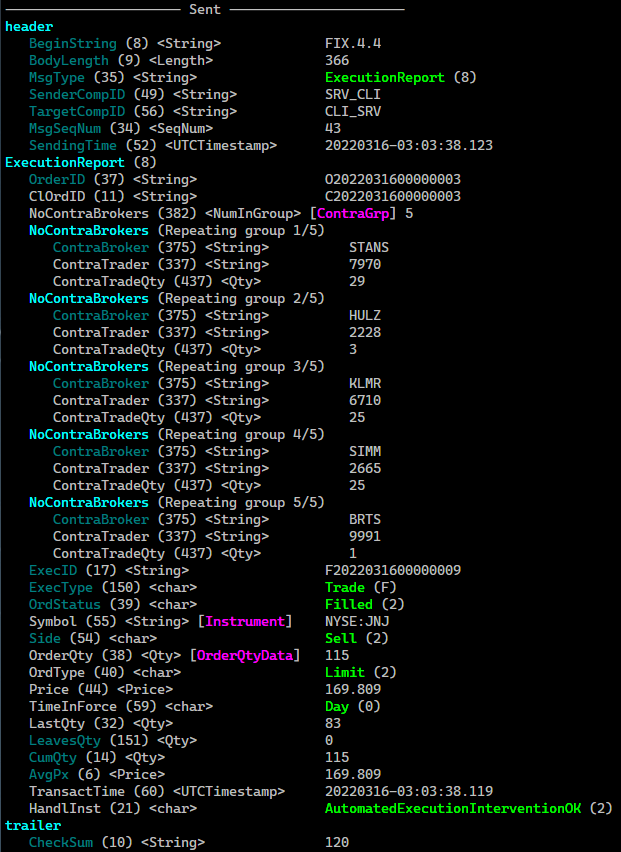

<p align="center">
  <a href="https://www.fix8mt.com"></a>
</p>

# Fix8Pro C++ example
#### An example client/server that can be used as a starting point for development using the Fix8Pro C++ Framework.

1.   [Introduction](#introduction)
1.   [Releases](#releases)
1.   [To download](#to-download)
1.   [Before you build](#before-you-build)
1.   [To build](#to-build)
1.   [To setup your run environment](#to-setup-your-run-environment)
1.   [CLI options](#cli-options)
1.   [To run](#to-run)
      1. [Run in Order Mode](#run-in-order-mode)
      1. [Run in Market Data Mode](#run-in-market-data-mode)
1.   [Securities](#securities)
1.   [Order Mode](#order-mode)
1.   [Market Data Mode](#market-data-mode)
      1. [About the orderbook and matching](#about-the-orderbook-and-matching)
3.   [About random numbers, distributions and generators used](#about-random-numbers-distributions-and-generators-used)
      1. [Prices](#prices)
1.   [Misc Functions](#misc-functions)
      1. [Capture Screen Output](#capture-screen-output)
      1. [Tick Capture](#tick-capture)
      1. [Thread Naming](#thread-naming)
1.   [Runtime Interaction](#runtime-interaction)
      1. [As Server](#as-server)
      1. [As Client](#as-client)
      1. [Command descriptions](#command-descriptions)
          1. [logout](#logout)
          1. [toggle summary](#toggle-summary)
          1. [disconnect](#disconnect)
          1. [just exit](#just-exit)
          1. [resubscribe](#resubscribe)
          1. [toggle generate](#toggle-generate)
          1. [toggle quiet](#toggle-quiet)
          1. [toggle states](#toggle-states)
6.   [Sample output](#sample-output)
      1.   [Server](#server)
      1.   [Client](#client)
      1.   [Misc](#misc)

------------------------------------------------------------------------
## Introduction
You have two main options when you develop a FIX application using Fix8Pro. For super high performance close to the metal, choose Fix8Pro C++ Framework (this example).
For high performance and rapid development using a range of modern languages, choose UFE.

The UFE package comes with freely available high performance UFEed© client adaptors. You can find full source code and instructions for all our UFEed adaptors (Python, Java, C# and C++)
on our [github repo](https://github.com/fix8mt/ufeed_bindings).

This example demonstrates how to create a client and a server that can accept or initiate FIX sessions. A client or server can run in two modes -
as an execution gateway processing orders and sending execution reports; and as a market data server, accepting market data subscriptions, sending full refreshes and incremental updates. These modes are discussed in detail below.

This example uses the standard FIX44 dictionary, uses high quality pseudo-random number generation classes provided by the C++ Standard Library and offers a model for creating trading simulations.

<kbd> 
  <p><i>Message displayed with the built-in Fix8Pro printer</i></p>
</kbd>

## Releases
There are a number of releases available. Each release builds on the previous in terms of complexity and functionality. These are summarised here:
1. Simple client/server with `NewOrderSingle` and `ExecutionReport` (order mode only). [Browse the source](https://github.com/fix8mt/fix8pro_example/tree/dd8603eef63d71aa3d87574a688b4fc0fa592875)
1. Client/server with market data generation, simple aggregated order book (order mode and market data mode). [Browse the source](https://github.com/fix8mt/fix8pro_example/tree/4960b3a7873d2f5492d4eae595467f71cc45e7d4)
1. Client/server with market data history (custom FIX messages) (order mode and market data mode). [Browse the source](https://github.com/fix8mt/fix8pro_example/tree/4960b3a7873d2f5492d4eae595467f71cc45e7d4)

You can read about all the available releases [`here`](https://github.com/fix8mt/fix8pro_example/releases). 

## To download
There are two branches: [`master`](https://github.com/fix8mt/fix8pro_example) (stable version)
and [`dev`](https://github.com/fix8mt/fix8pro_example/tree/dev) (latest cutting edge).

Optionally specify the `dev` branch when you clone:
```bash
git clone https://github.com/fix8mt/fix8pro_example.git [-b dev]
cd fix8pro_example
```

## Before you build
You will need the following to build this example:
1. A supported [`C++17`](https://en.wikipedia.org/wiki/C%2B%2B17) compiler and build environment
1. A Fix8Pro license from [`Fix8MT`](https://fix8mt.com/) (or an evaluation license)
1. An installed Fix8Pro binary [package](https://www.fix8mt.com/releases), minimum version **22.03**

## To build
For example assuming you have installed Fix8Pro to `/opt/fix8pro` and your license file is also in `/opt/fix8pro`:
```bash
mkdir build
cd build
cmake -DFIX8PRO_LICENSE_FILE=/opt/fix8pro/mylic.xml -DFIX8PRO_ROOT=/opt/fix8pro -DCMAKE_INSTALL_PREFIX=./ -DCMAKE_BUILD_TYPE=Release ..
make install
```

## To setup your run environment
1. Add your Fix8Pro binary and library installation directories to your `$PATH` and `$LD_LIBRARY_PATH`.
For example, if you installed Fix8Pro to `/opt/fix8pro`:
```bash
export PATH=$PATH:/opt/fix8pro/bin
export LD_LIBRARY_PATH=$LD_LIBRARY_PATH:/opt/fix8pro/lib
```
2. Set your `$FIX8PRO_LICENSE_FILE` environment variable.
For example, if your license file is in `/opt/fix8pro`:
```bash
export FIX8PRO_LICENSE_FILE=/opt/fix8pro/mylic.xml
```

## CLI options

<details><summary><i>These options are defined in </i><tt>Application::options_setup()</tt>. <i>Some of the options are added by </i><tt>Fix8ProApplication</tt>.</summary>
<p>

```bash
% ./simpleclisrv -h
Fix8Pro sample client/server
Usage:
  simpleclisrv [OPTION...]

  -b, --brownopts arg      set the Brownian options (drift,volume,lpf)
                           parameters (default: 0.01,20.0,0.025)
  -c, --config arg         xml config (default: simple_client.xml or
                           simple_server.xml)
  -d, --depth arg          use with market data mode, set maximum depth to
                           request on subscription (default: 10)
  -f, --refdata arg        specify alternate security reference data
  -g, --giveupreset arg    number of reliable reconnects to try before
                           resetting seqnums (default: 10)
  -k, --capture arg        capture all screen output to specified file
  -l, --log arg            global log filename (default:
                           ./run/client_%{DATE}_global.log or ./run/server_%{DATE}_global.log)
  -m, --marketdata         run in marketdata mode (default order mode)
  -n, --numsec arg         maximum number of securities to use (default no
                           limit) (default: 0)
  -q, --quiet              do not print fix output
  -r, --reliable           start in reliable mode (default: true)
  -s, --server             run in server mode (default client mode)
  -t, --states             show session and reliable session thread state
                           changes (default: true)
  -u, --summary            run in summary display mode
  -C, --clientsession arg  name of client session profile in xml config to
                           use (default: CLI)
  -G, --generate           generate NewOrderSingle(client) or market
                           data(server) messages (default: true)
  -H, --showheartbeats     show inbound heartbeats (default: true)
  -I, --interval arg       generation interval (msecs); if -ve choose random
                           interval between 0 and -(n) (default: 5000)
  -K, --tickcapture arg    capture all trade ticks to specified file
  -L, --libpath arg        library path to load Fix8 schema object, default
                           path or LD_LIBRARY_PATH
  -P, --password arg       FIX password used in logon (cleartext) (default:
                           password)
  -R, --receive arg        set next expected receive sequence number
                           (default: 0)
  -S, --send arg           set next expected send sequence number (default:
                           0)
  -T, --threadname arg     prefix thread names with given string
  -U, --username arg       FIX username used in logon (default: testuser)
  -V, --serversession arg  name of server session profile in xml config to
                           use (default: SRV)
  -D, --debug              debug mode

 info options:
  -h, --help          Help screen
  -v, --version       Version
  -0, --showcmdline   Show cmdline details
  -5, --environment   Show FIX8PRO environment variable help; show env vars
                      (debug mode)
  -6, --dependencies  Show shared library dependencies
  -7, --binaryreport  Show ABI, lib and binary info
  -8, --appinfo       Show application banner and info

 history options:
  -1, --history      Print command history; look in current directory or in
                     $FIX8PRO_CMD_HIST_DIR; use $FIX8PRO_CMD_HIST_SIZE to set
                     max history or 0 to turn off
  -2, --invoke arg   Invoke given command by index (use -ve from last)
  -3, --remove       Remove all history
  -4, --interactive  Interactve mode, select/edit using bash-like commands,
                     (? <enter> for help)

examples:
cli/srv pair:
   simpleclisrv -c config/simple_server.xml -s
   simpleclisrv -c config/simple_client.xml
cli/srv pair with supplied hash pw, random generation interval (~1s), base thread named, run server in summary mode:
   simpleclisrv -sc ../config/simple_server.xml -P 5e884898da28047151d0e56f8dc6292773603d0d6aabbdd62a11ef721d1542d8 -u -T clisrv
   simpleclisrv -c ../config/simple_client.xml -I -1000 -P 5e884898da28047151d0e56f8dc6292773603d0d6aabbdd62a11ef721d1542d8 -u -T clisrv
cli/srv pair running in market data mode, load refdata from file, random generation interval (~1s), client depth 30 levels:
   simpleclisrv -sc ../config/simple_server.xml -u -T clisrv -f ../config/sample_ref_data.csv
   simpleclisrv -c ../config/simple_client.xml -I -1000 -u -T clisrv -d 30
```

</p>
</details>

## To run
This example has been designed to run as two instances - a client and a server. For simplicity we'll run the test from the `./build` directory.
By default, the application runs in 'order mode'.

### Run in Order Mode
In one terminal we'll run our server:
```bash
./simpleclisrv -c ../config/simple_server.xml -s
```
In our other terminal we'll run our client:
```bash
./simpleclisrv -c ../config/simple_client.xml
```
- When connected, the client will send a `NewOrderSingle` every 5 seconds. The server will simulate an order accept and trade, sending back an acknowledgment followed by a random number of fills (`ExecutionReport`s).
- From the client, press `l<enter>` to logout and shutdown, `q<enter>` to shutdown and `x<enter>` to just exit

### Run in Market Data Mode
```bash
./simpleclisrv -c ../config/simple_server.xml -s -m
```
In our other terminal run the client:
```bash
./simpleclisrv -c ../config/simple_client.xml -m
```
- When connected, the client will send a `SecurityListRequest`. The server will respond with a `SecurityList` message containing repeating groups of all available securities. The client will then randomly
select a sub-set of those securities and send `MarketDataRequest` messages subscribing to those securities. The server will then respond with `MarketDataIncrementalRefresh` and `MarketDataSnapshotFullRefresh` messages
which will show incremental changes to a simulated order book, top of book and full market depth.
- From the client, press `l<enter>` to logout and shutdown, `q<enter>` to shutdown and `x<enter>` to just exit

## Securities
The default set of secutities used in both order and market data modes are hard coded in the application (the static `Instrument` table is show below). The values for each symbol are a reference price and the maximum quantity that can be ordered:
```cpp
const Instruments SimpleSession::_staticdata
{
   { "AAPL:NASDAQ",  { 163.17,   50 } },  { "MSFT:NASDAQ",  { 289.86,   50 } },
   { "GOOG:NASDAQ",  { 2642.44,  100 } }, { "AMZN:NASDAQ",  { 2912.82,  100 } },
   { "TSLA:NASDAQ",  { 838.29,   120 } }, { "MMM:NYSE",     { 149.5,    120 } },
   { "FB:NASDAQ",    { 200.06,   120 } }, { "NVDA:NASDAQ",  { 229.36,   120 } },
   { "UNH:NYSE",     { 498.65,   120 } }, { "JNJ:NYSE",     { 169.48,   120 } },
   { "V:NYSE",       { 200.29,   120 } }, { "JPM:NYSE",     { 134.40,   300 } },
   { "WMT:NYSE",     { 142.82,   300 } }, { "PG:NYSE",      { 155.14,   300 } },
   { "XOM:NYSE",     { 84.09,    300 } }, { "HD:NYSE",      { 324.26,   300 } },
   { "BAC:NYSE",     { 40.95,    200 } }, { "MC:NYSE",      { 330.76,   200 } },
   { "CVX:NYSE",     { 158.65,   200 } }, { "PFE:NYSE",     { 48.65,    200 } },
};
```
You can supply your own list of securities in CSV format (see `-f` option). A sample 100 US stocks is provided in the file `config/sample_ref_data.csv`, a sample is shown here:
```
# security, refprice, max order qty
AAPL:NASDAQ,   163.17,  50
MSFT:NASDAQ,   289.86,  50
GOOG:NASDAQ,   2642.44, 100
AMZN:NASDAQ,   2912.82, 100
TSLA:NASDAQ,   838.29,  120
MMM:NYSE,      149.5,   120
FB:NASDAQ,     200.06,  120
NVDA:NASDAQ,   229.36,  120
UNH:NYSE,      498.65,  120
JNJ:NYSE,      169.48,  120
V:NYSE,        200.29,  120
JPM:NYSE,      134.40,  300
WMT:NYSE,      142.82,  300
PG:NYSE,       155.14,  300
XOM:NYSE,      84.09,   300
HD:NYSE,       324.26,  300
BAC:NYSE,      40.95,   200
MC:NYSE,       330.76,  200
CVX:NYSE,      158.65,  200
PFE:NYSE,      48.65,   200
ABBV:NASDAQ,   161.89,  100
LLY:NYSE,      291.42,  200
```

## Order Mode
This is the default mode for the client and server. After the client logs in and establishes a normal session, it will begin to send `NewOrderSingle` order messages from a randomly selected symbol.

The client generates orders using the following method:
1. A security is randomly selected
1. A randomly selected quantity is chosen, from 1 - maximum
1. A randomly selected price is chosen, using the cauchy distribution (see notes below)
1. `OrdType` is set to limit
1. Randomly selected `HandlInst`, `TimeInForce` and `Side` are chosen

The server receives the order and responds using the following method:
1. Orders are randomly accepted or rejected by an average of 4 to 1
1. Fields are automatically copied from the inbound `NewOrderSingle` to the outbound `ExecutionReport` where legal
1. For rejected orders, a randomly selected `OrdRejReason` is chosen and an order reject is sent
1. For accepted orders, an order acknowledgement is sent
1. Orders will randomly fill or rest by an average of 3 to 1
1. For filled orders, the orders will completely fill immediately by an average of 1 in 4
1. The remaining quantities are randomly filled by successive `ExecutionReport` messages until exhausted
1. Each fill is also randomly assigned 1 to 12 `ContraBroker`s with a randomly chosen sub-quantity and `ContraTrader` ID in repeating groups

## Market Data Mode
This mode simulates a market data service. After the client logs in and establishes a normal session, it will request a list of securities, subscribe to some and then receive market data updates continually from the server. The market data generated in this mode is not the same data generated in order mode.

This process is described below:

The client subscribes as follows:
1. At startup or if resubscribe is triggered, the client sends a `SecurityListRequest`;
1. A `SecurityList` is received, containing repeating groups of all available securities
1. From a randomly selected sub-set of these securities, `MarketDataRequest` messages are sent; `SubscriptionRequestType::SnapshotAndUpdates` is chosen;
the default number of depth levels is set to 10. You can override this on the client command line with the `-d` option

The server operates as follows:
1. When a `SecurityListRequest` is received the server responds with a `SecurityList` containing repeating groups of all available securities
1. The server then generates prices continually for all subscribed securities using the same algorithm as Order Mode
1. A `MarketDataSnapshotFullRefresh` is sent about 1 in 10 messages
1. When `MarketDataSnapshotFullRefresh` is sent, about 1 in 2 are top of book (TOB) refreshes containing Best Bid/Volume, Best Offer/Volume, Open, High, Low, Close,
Last/Volume, Total Volume, VWAP and Imbalance
1. The other `MarketDataSnapshotFullRefresh` messages will be the full aggregated orderbook, containing all the depth levels up to the maximum requested (default 10)
1. A `MarketDataIncrementalRefresh` is sent about 9 in 10 messages. Of these, about 1 in 4 will be cancels, the rest new orders
1. When an order is generated a matching algorithm attempts to match out the order; remaining volume is then inserted into the orderbook
1. Order cancels are applied directly to the orderbook
1. After matching or cancelling orders, a difference algorithm generates a series of book deltas

### About the orderbook and matching
1. Each security has its own double sided aggregated orderbook. Bids are reverse sorted by price, asks are sorted by price.
Individual (unaggregated) orders are not maintained.
1. Each price level holds the total accumulated order quantity and the total number of orders
1. Matching occurs only when a new order is generated; orders are matched out from the top of the book, exhausting all available
quantity at or below (above) the best bid or offer; matched quantities are subtracted from the available quantity; price levels are
removed when no quantity or order count remains
1. Any remaining quantity not matched is inserted into the orderbook
1. Only limit GTC orders are supported
1. A 'daily' record is maintained for each security which contains Open, High, Low, Close, Last/Volume, Total Volume and Total Price Volume (TPV)
1. VWAP and Imbalance are calculated when a `MarketDataSnapshotFullRefresh` TOB is sent using the TPV and best bid/offer quantities

## About random numbers, distributions and generators used
We are using the following pseudo-random number generation functions provided by the standard library:
1. [`std::mersenne_twister_engine`](https://en.wikipedia.org/wiki/Mersenne_Twister) engine (mt19937_64) seeded using the `std::random_device` (with optionally supplied implementation-defined token)
1. [`std::uniform_int_distribution`](https://en.wikipedia.org/wiki/Discrete_uniform_distribution) is used to select random integers from a range
1. [`std::uniform_real_distribution`](https://en.wikipedia.org/wiki/Discrete_uniform_distribution) is used to select random floating point numbers from a range
1. [`std::bernoulli_distribution`](https://en.wikipedia.org/wiki/Bernoulli_distribution) is used to select a random boolean value with a specified probability

### Prices
Prices are generated using random numbers from the uniform real distribution. These are then put through a Brownian filter, described [here](https://en.wikipedia.org/wiki/Wiener_process). The parameters to this filter can be set from the command line.

<kbd> 
  <p><i>Tick chart for the symbol PEP:NASDAQ from prices generated by this application, demonstrating the Brownian filter</i></p>
</kbd>

The following parameters can be set on the command line:

| Parameter | Description | Range | Default |
| --------- | ----------- | ------| ------- |
| drift | random amount to drift | 0.0 - 1.0 | 0.01 |
| volume | amount of 'swing' | 0.0 - 50.0 | 20.0 |
| lpf | low pass filter level | 0.0 - 1.0 | 0.025 |

Larger _drift_ yields larger trends away from the reference price. Larger _volume_ has a similar effect. Lower _lpf_ creats more varibility. You will need to experiemt to find the combination of the three to suit your purposes.

## Runtime Interaction
A simple command menu is provided where you can control certain aspects of the application.

### As Server
```
l - logout
s - toggle summary
q - disconnect (no logout)
x - just exit
g - toggle generate (market data mode)
Q - toggle quiet
S - toggle states
? - help
```
### As Client
```
l - logout and quit
q - quit (no logout)
x - just exit
g - toggle generate (order mode)
G - resubscribe (market data mode)
s - toggle summary
Q - toggle quiet
S - toggle states
? - help
```
### Command descriptions
#### logout
Sends a `Logout` message, waits for a `Logout` reply. In server mode, the server will listen for a new connection; in client mode the application exits
#### toggle summary
Toggles between summary mode and full message display mode. In summary mode a single line is displayed for each message or repeating group element
#### disconnect
Closes the session without sending a logout
#### just exit
Exits the application without logout or closing the session
#### resubscribe
From the client in market data mode, unsubscribes and resubscribes to market data, randomly selecting a new set of securities
#### toggle generate
In market data mode, toggles the generation of market data from the server; in order mode, toggles the generation of orders from the client
#### toggle quiet
Toggles output; when client mode is on, no market data or order messages are displayed
#### toggle states
When enabled, the application will verbosely display session and reliable session states as they change

## Misc Functions
### Capture Screen Output
Passing a filename with the `--capture` switch will cause the client (or server) to send a copy of all screen output to specified file. Note that screen escape sequences (such as colours, etc) will be filtered out.

### Tick Capture
Passing a filename with the `--tickcapture` will cause the server to save each tick to the specified file. Use in combination with `--numsec 1` to capture a single security's tick data.

### Thread Naming
Passing a name with the `--threadname` will cause the client or server to append the name to the OS thread name. This will allow you to identify the application threads and filter them by name for viewing (see example below).

## Sample output

### Server

<details><summary><i>Shows the server responding to a NewOrderSingle by sending an ExecutionReport.</i></summary>
<p>

<kbd> 

</p>
</details>

<details><summary><i>Shows the server sending and receiving messages (summary mode).</i></summary>
<p>

<kbd> 

</p>
</details>

### Client

<details><summary><i>Shows the client receiving an ExecutionReport (verbose mode).</i></summary>
<p>

<kbd> 

</p>
</details>

<details><summary><i>Shows the client sending and receiving messages (summary mode).</i></summary>
<p>

<kbd> 

</p>
</details>

<details><summary><i>Shows a reliable client attempting to reconnect, finally performing an automatic sequence reset and successfully connecting. Notice the state changes.</i></summary>

<p>

<kbd> 

</p>
</details>

### Misc

<details><summary><i>Using thread naming and filtering with htop, showing client and server threads.</i></summary>
<p>

<kbd> 

</p>
</details>

