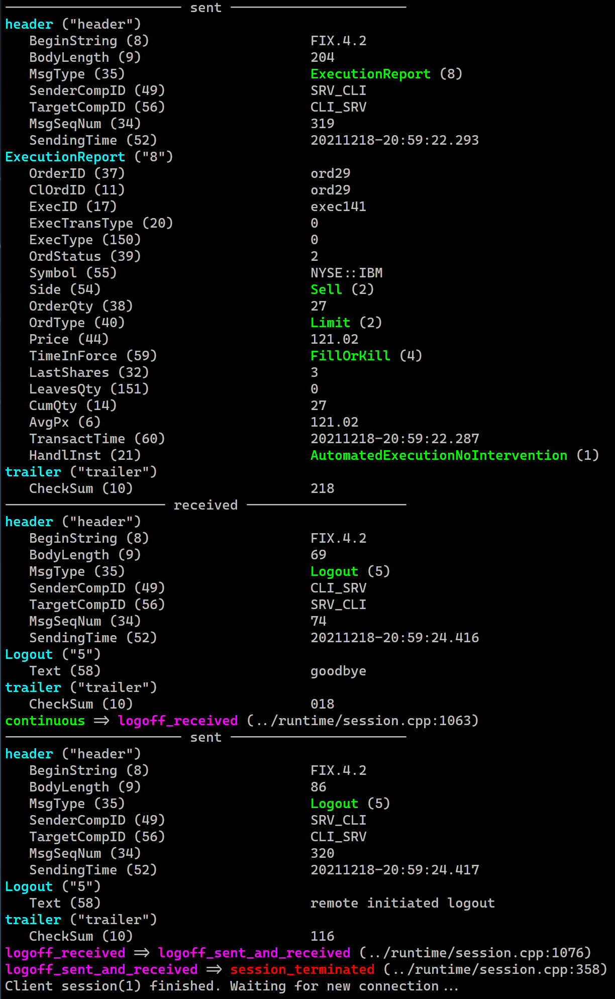

<p align="center">
  <a href="https://www.fix8mt.com"></a>
</p>

# Fix8Pro C++ example
An example client/server that can be used as a starting point for development using the Fix8Pro C++ Framework.

-   [To download](#to-download)
-   [Before you build](#before-you-build)
-   [To build](#to-build)
-   [To setup your run environment](#to-setup-your-run-environment)
-   [To run](#to-run)
-   [Sample output](#sample-output)
    1.   [Output server](#output-server)
    1.   [Screenshot server](#screenshot-server)
    1.  [Output client](#output-client)
    1.   [Screenshot client](#screenshot-client)

------------------------------------------------------------------------

## To download
```bash
git clone https://github.com/fix8mt/fix8pro_example.git
cd fix8pro_example
```

## Before you build
You will need the following to build this example:
1. A supported C++17 compiler and build environment
1. A Fix8Pro license from Fix8MT (or an evaluation license)
1. An installed Fix8Pro binary package

## To build
For example assuming you have installed Fix8Pro to `/opt/fix8pro` and your license file is also in `/opt/fix8pro`:
```bash
mkdir build
cd build
cmake -DFIX8PRO_LICENSE_FILE=/opt/fix8pro/mylic.xml -DFIX8PRO_ROOT=/opt/fix8pro -DCMAKE_INSTALL_PREFIX=./ -DCMAKE_BUILD_TYPE=Release ..
make install
```

## To setup your run environment
1. Add your Fix8Pro binary and library installation directories to your `$PATH` and `$LD_LIBRARY_PATH`.
For example, if you installed Fix8Pro to `/opt/fix8pro`:
```bash
export PATH=$PATH:/opt/fix8pro/bin
export LD_LIBRARY_PATH=$LD_LIBRARY_PATH:/opt/fix8pro/lib
```
2. Set your `$FIX8PRO_LICENSE_FILE` environment variable.
For example, if your license file is in `/opt/fix8pro`:
```bash
export FIX8PRO_LICENSE_FILE=/opt/fix8pro/mylic.xml
```

## To run
This example has been designed to run as two instances - a client and a server. For simplicity we'll run the test from the `./build` directory.
In one terminal we'll run our server:
```bash
./simpleclisrv -c ../config/simple_server.xml -s
```
In our other terminal we'll run our client:
```bash
./simpleclisrv -c ../config/simple_client.xml
```
- When connected, the client will send a `NewOrderSingle` every 5 seconds. The server will simulate an order accept and trade, sending back an acknowledgment followed by a random number of fills (`ExecutionReport`s).
- From the client, press `l<enter>` to logout and shutdown, `q<enter>` to shutdown and `x<enter>` to just exit

## Sample output

### Output server

<details><summary><i>expand</i></summary>
<p>

```bash
% ./simpleclisrv -c ../config/simple_server.xml -s
loaded: libFIX42d.so
Client session(1) connection established.
none => wait_for_logon (../runtime/session.cpp:250)
-------------------- received --------------------
header ("header")
   BeginString (8)                    FIX.4.2
   BodyLength (9)                     69
   MsgType (35)                       Logon (A)
   SenderCompID (49)                  CLI_SRV
   TargetCompID (56)                  SRV_CLI
   MsgSeqNum (34)                     1
   SendingTime (52)                   20211210-05:08:18.993
Logon ("A")
   EncryptMethod (98)                 None (0)
   HeartBtInt (108)                   10
trailer ("trailer")
   CheckSum (10)                      105
wait_for_logon => logon_received (../runtime/session.cpp:735)
---------------------- sent ----------------------
header ("header")
   BeginString (8)                    FIX.4.2
   BodyLength (9)                     69
   MsgType (35)                       Logon (A)
   SenderCompID (49)                  SRV_CLI
   TargetCompID (56)                  CLI_SRV
   MsgSeqNum (34)                     1
   SendingTime (52)                   20211210-05:08:18.999
Logon ("A")
   EncryptMethod (98)                 0
   HeartBtInt (108)                   10
trailer ("trailer")
   CheckSum (10)                      111
logon_received => continuous (../runtime/session.cpp:1022)
-------------------- received --------------------
header ("header")
   BeginString (8)                    FIX.4.2
   BodyLength (9)                     140
   MsgType (35)                       NewOrderSingle (D)
   SenderCompID (49)                  CLI_SRV
   TargetCompID (56)                  SRV_CLI
   MsgSeqNum (34)                     2
   SendingTime (52)                   20211210-05:08:23.992
NewOrderSingle ("D")
   ClOrdID (11)                       ord1
   HandlInst (21)                     AutomatedExecutionNoIntervention (1)
   Symbol (55)                        NYSE::IBM
   Side (54)                          Buy (1)
   TransactTime (60)                  20211210-05:08:23.991
   OrderQty (38)                      25
   OrdType (40)                       Limit (2)
   Price (44)                         119.635
   TimeInForce (59)                   FillOrKill (4)
trailer ("trailer")
   CheckSum (10)                      012
---------------------- sent ----------------------
header ("header")
   BeginString (8)                    FIX.4.2
   BodyLength (9)                     193
   MsgType (35)                       ExecutionReport (8)
   SenderCompID (49)                  SRV_CLI
   TargetCompID (56)                  CLI_SRV
   MsgSeqNum (34)                     2
   SendingTime (52)                   20211210-05:08:23.993
ExecutionReport ("8")
   OrderID (37)                       ord1
   ClOrdID (11)                       ord1
   ExecID (17)                        exec1
   ExecTransType (20)                 0
   ExecType (150)                     0
   OrdStatus (39)                     0
   Symbol (55)                        NYSE::IBM
   Side (54)                          Buy (1)
   OrderQty (38)                      25
   OrdType (40)                       Limit (2)
   Price (44)                         119.63
   TimeInForce (59)                   FillOrKill (4)
   LastCapacity (29)                  4
   LeavesQty (151)                    25
   CumQty (14)                        0
   AvgPx (6)                          0
   TransactTime (60)                  20211210-05:08:23.991
   HandlInst (21)                     AutomatedExecutionNoIntervention (1)
trailer ("trailer")
   CheckSum (10)                      172
---------------------- sent ----------------------
header ("header")
   BeginString (8)                    FIX.4.2
   BodyLength (9)                     199
   MsgType (35)                       ExecutionReport (8)
   SenderCompID (49)                  SRV_CLI
   TargetCompID (56)                  CLI_SRV
   MsgSeqNum (34)                     3
   SendingTime (52)                   20211210-05:08:24.006
ExecutionReport ("8")
   OrderID (37)                       ord1
   ClOrdID (11)                       ord1
   ExecID (17)                        exec2
   ExecTransType (20)                 0
   ExecType (150)                     0
   OrdStatus (39)                     1
   Symbol (55)                        NYSE::IBM
   Side (54)                          Buy (1)
   OrderQty (38)                      25
   OrdType (40)                       Limit (2)
   Price (44)                         119.63
   TimeInForce (59)                   FillOrKill (4)
   LastShares (32)                    21
   LeavesQty (151)                    4
   CumQty (14)                        21
   AvgPx (6)                          119.63
   TransactTime (60)                  20211210-05:08:23.991
   HandlInst (21)                     AutomatedExecutionNoIntervention (1)
trailer ("trailer")
   CheckSum (10)                      210
---------------------- sent ----------------------
header ("header")
   BeginString (8)                    FIX.4.2
   BodyLength (9)                     198
   MsgType (35)                       ExecutionReport (8)
   SenderCompID (49)                  SRV_CLI
   TargetCompID (56)                  CLI_SRV
   MsgSeqNum (34)                     4
   SendingTime (52)                   20211210-05:08:24.007
ExecutionReport ("8")
   OrderID (37)                       ord1
   ClOrdID (11)                       ord1
   ExecID (17)                        exec3
   ExecTransType (20)                 0
   ExecType (150)                     0
   OrdStatus (39)                     2
   Symbol (55)                        NYSE::IBM
   Side (54)                          Buy (1)
   OrderQty (38)                      25
   OrdType (40)                       Limit (2)
   Price (44)                         119.63
   TimeInForce (59)                   FillOrKill (4)
   LastShares (32)                    4
   LeavesQty (151)                    0
   CumQty (14)                        25
   AvgPx (6)                          119.63
   TransactTime (60)                  20211210-05:08:23.991
   HandlInst (21)                     AutomatedExecutionNoIntervention (1)
trailer ("trailer")
   CheckSum (10)                      166
-------------------- received --------------------
header ("header")
   BeginString (8)                    FIX.4.2
   BodyLength (9)                     140
   MsgType (35)                       NewOrderSingle (D)
   SenderCompID (49)                  CLI_SRV
   TargetCompID (56)                  SRV_CLI
   MsgSeqNum (34)                     3
   SendingTime (52)                   20211210-05:08:29.008
NewOrderSingle ("D")
   ClOrdID (11)                       ord2
   HandlInst (21)                     AutomatedExecutionNoIntervention (1)
   Symbol (55)                        NYSE::IBM
   Side (54)                          Sell (2)
   TransactTime (60)                  20211210-05:08:29.008
   OrderQty (38)                      14
   OrdType (40)                       Limit (2)
   Price (44)                         119.944
   TimeInForce (59)                   FillOrKill (4)
trailer ("trailer")
   CheckSum (10)                      005
---------------------- sent ----------------------
header ("header")
   BeginString (8)                    FIX.4.2
   BodyLength (9)                     193
   MsgType (35)                       ExecutionReport (8)
   SenderCompID (49)                  SRV_CLI
   TargetCompID (56)                  CLI_SRV
   MsgSeqNum (34)                     5
   SendingTime (52)                   20211210-05:08:29.010
ExecutionReport ("8")
   OrderID (37)                       ord2
   ClOrdID (11)                       ord2
   ExecID (17)                        exec4
   ExecTransType (20)                 0
   ExecType (150)                     0
   OrdStatus (39)                     0
   Symbol (55)                        NYSE::IBM
   Side (54)                          Sell (2)
   OrderQty (38)                      14
   OrdType (40)                       Limit (2)
   Price (44)                         119.94
   TimeInForce (59)                   FillOrKill (4)
   LastCapacity (29)                  4
   LeavesQty (151)                    14
   CumQty (14)                        0
   AvgPx (6)                          0
   TransactTime (60)                  20211210-05:08:29.008
   HandlInst (21)                     AutomatedExecutionNoIntervention (1)
trailer ("trailer")
   CheckSum (10)                      162
---------------------- sent ----------------------
header ("header")
   BeginString (8)                    FIX.4.2
   BodyLength (9)                     199
   MsgType (35)                       ExecutionReport (8)
   SenderCompID (49)                  SRV_CLI
   TargetCompID (56)                  CLI_SRV
   MsgSeqNum (34)                     6
   SendingTime (52)                   20211210-05:08:29.023
ExecutionReport ("8")
   OrderID (37)                       ord2
   ClOrdID (11)                       ord2
   ExecID (17)                        exec5
   ExecTransType (20)                 0
   ExecType (150)                     0
   OrdStatus (39)                     2
   Symbol (55)                        NYSE::IBM
   Side (54)                          Sell (2)
   OrderQty (38)                      14
   OrdType (40)                       Limit (2)
   Price (44)                         119.94
   TimeInForce (59)                   FillOrKill (4)
   LastShares (32)                    14
   LeavesQty (151)                    0
   CumQty (14)                        14
   AvgPx (6)                          119.94
   TransactTime (60)                  20211210-05:08:29.008
   HandlInst (21)                     AutomatedExecutionNoIntervention (1)
trailer ("trailer")
   CheckSum (10)                      225
-------------------- received --------------------
header ("header")
   BeginString (8)                    FIX.4.2
   BodyLength (9)                     140
   MsgType (35)                       NewOrderSingle (D)
   SenderCompID (49)                  CLI_SRV
   TargetCompID (56)                  SRV_CLI
   MsgSeqNum (34)                     4
   SendingTime (52)                   20211210-05:08:34.028
NewOrderSingle ("D")
   ClOrdID (11)                       ord3
   HandlInst (21)                     AutomatedExecutionNoIntervention (1)
   Symbol (55)                        NYSE::IBM
   Side (54)                          Sell (2)
   TransactTime (60)                  20211210-05:08:34.028
   OrderQty (38)                      20
   OrdType (40)                       Limit (2)
   Price (44)                         119.706
   TimeInForce (59)                   FillOrKill (4)
trailer ("trailer")
   CheckSum (10)                      252
---------------------- sent ----------------------
header ("header")
   BeginString (8)                    FIX.4.2
   BodyLength (9)                     193
   MsgType (35)                       ExecutionReport (8)
   SenderCompID (49)                  SRV_CLI
   TargetCompID (56)                  CLI_SRV
   MsgSeqNum (34)                     7
   SendingTime (52)                   20211210-05:08:34.029
ExecutionReport ("8")
   OrderID (37)                       ord3
   ClOrdID (11)                       ord3
   ExecID (17)                        exec6
   ExecTransType (20)                 0
   ExecType (150)                     0
   OrdStatus (39)                     0
   Symbol (55)                        NYSE::IBM
   Side (54)                          Sell (2)
   OrderQty (38)                      20
   OrdType (40)                       Limit (2)
   Price (44)                         119.71
   TimeInForce (59)                   FillOrKill (4)
   LastCapacity (29)                  4
   LeavesQty (151)                    20
   CumQty (14)                        0
   AvgPx (6)                          0
   TransactTime (60)                  20211210-05:08:34.028
   HandlInst (21)                     AutomatedExecutionNoIntervention (1)
trailer ("trailer")
   CheckSum (10)                      161
---------------------- sent ----------------------
header ("header")
   BeginString (8)                    FIX.4.2
   BodyLength (9)                     199
   MsgType (35)                       ExecutionReport (8)
   SenderCompID (49)                  SRV_CLI
   TargetCompID (56)                  CLI_SRV
   MsgSeqNum (34)                     8
   SendingTime (52)                   20211210-05:08:34.030
ExecutionReport ("8")
   OrderID (37)                       ord3
   ClOrdID (11)                       ord3
   ExecID (17)                        exec7
   ExecTransType (20)                 0
   ExecType (150)                     0
   OrdStatus (39)                     2
   Symbol (55)                        NYSE::IBM
   Side (54)                          Sell (2)
   OrderQty (38)                      20
   OrdType (40)                       Limit (2)
   Price (44)                         119.71
   TimeInForce (59)                   FillOrKill (4)
   LastShares (32)                    20
   LeavesQty (151)                    0
   CumQty (14)                        20
   AvgPx (6)                          119.71
   TransactTime (60)                  20211210-05:08:34.028
   HandlInst (21)                     AutomatedExecutionNoIntervention (1)
trailer ("trailer")
   CheckSum (10)                      204
-------------------- received --------------------
header ("header")
   BeginString (8)                    FIX.4.2
   BodyLength (9)                     140
   MsgType (35)                       NewOrderSingle (D)
   SenderCompID (49)                  CLI_SRV
   TargetCompID (56)                  SRV_CLI
   MsgSeqNum (34)                     5
   SendingTime (52)                   20211210-05:08:39.033
NewOrderSingle ("D")
   ClOrdID (11)                       ord4
   HandlInst (21)                     AutomatedExecutionNoIntervention (1)
   Symbol (55)                        NYSE::IBM
   Side (54)                          Sell (2)
   TransactTime (60)                  20211210-05:08:39.033
   OrderQty (38)                      21
   OrdType (40)                       Limit (2)
   Price (44)                         120.451
   TimeInForce (59)                   FillOrKill (4)
trailer ("trailer")
   CheckSum (10)                      246
---------------------- sent ----------------------
header ("header")
   BeginString (8)                    FIX.4.2
   BodyLength (9)                     193
   MsgType (35)                       ExecutionReport (8)
   SenderCompID (49)                  SRV_CLI
   TargetCompID (56)                  CLI_SRV
   MsgSeqNum (34)                     9
   SendingTime (52)                   20211210-05:08:39.034
ExecutionReport ("8")
   OrderID (37)                       ord4
   ClOrdID (11)                       ord4
   ExecID (17)                        exec8
   ExecTransType (20)                 0
   ExecType (150)                     0
   OrdStatus (39)                     0
   Symbol (55)                        NYSE::IBM
   Side (54)                          Sell (2)
   OrderQty (38)                      21
   OrdType (40)                       Limit (2)
   Price (44)                         120.45
   TimeInForce (59)                   FillOrKill (4)
   LastCapacity (29)                  4
   LeavesQty (151)                    21
   CumQty (14)                        0
   AvgPx (6)                          0
   TransactTime (60)                  20211210-05:08:39.033
   HandlInst (21)                     AutomatedExecutionNoIntervention (1)
trailer ("trailer")
   CheckSum (10)                      164
---------------------- sent ----------------------
header ("header")
   BeginString (8)                    FIX.4.2
   BodyLength (9)                     200
   MsgType (35)                       ExecutionReport (8)
   SenderCompID (49)                  SRV_CLI
   TargetCompID (56)                  CLI_SRV
   MsgSeqNum (34)                     10
   SendingTime (52)                   20211210-05:08:39.048
ExecutionReport ("8")
   OrderID (37)                       ord4
   ClOrdID (11)                       ord4
   ExecID (17)                        exec9
   ExecTransType (20)                 0
   ExecType (150)                     0
   OrdStatus (39)                     1
   Symbol (55)                        NYSE::IBM
   Side (54)                          Sell (2)
   OrderQty (38)                      21
   OrdType (40)                       Limit (2)
   Price (44)                         120.45
   TimeInForce (59)                   FillOrKill (4)
   LastShares (32)                    18
   LeavesQty (151)                    3
   CumQty (14)                        18
   AvgPx (6)                          120.45
   TransactTime (60)                  20211210-05:08:39.033
   HandlInst (21)                     AutomatedExecutionNoIntervention (1)
trailer ("trailer")
   CheckSum (10)                      250
---------------------- sent ----------------------
header ("header")
   BeginString (8)                    FIX.4.2
   BodyLength (9)                     200
   MsgType (35)                       ExecutionReport (8)
   SenderCompID (49)                  SRV_CLI
   TargetCompID (56)                  CLI_SRV
   MsgSeqNum (34)                     11
   SendingTime (52)                   20211210-05:08:39.049
ExecutionReport ("8")
   OrderID (37)                       ord4
   ClOrdID (11)                       ord4
   ExecID (17)                        exec10
   ExecTransType (20)                 0
   ExecType (150)                     0
   OrdStatus (39)                     1
   Symbol (55)                        NYSE::IBM
   Side (54)                          Sell (2)
   OrderQty (38)                      21
   OrdType (40)                       Limit (2)
   Price (44)                         120.45
   TimeInForce (59)                   FillOrKill (4)
   LastShares (32)                    2
   LeavesQty (151)                    1
   CumQty (14)                        20
   AvgPx (6)                          120.45
   TransactTime (60)                  20211210-05:08:39.033
   HandlInst (21)                     AutomatedExecutionNoIntervention (1)
trailer ("trailer")
   CheckSum (10)                      228
---------------------- sent ----------------------
header ("header")
   BeginString (8)                    FIX.4.2
   BodyLength (9)                     200
   MsgType (35)                       ExecutionReport (8)
   SenderCompID (49)                  SRV_CLI
   TargetCompID (56)                  CLI_SRV
   MsgSeqNum (34)                     12
   SendingTime (52)                   20211210-05:08:39.050
ExecutionReport ("8")
   OrderID (37)                       ord4
   ClOrdID (11)                       ord4
   ExecID (17)                        exec11
   ExecTransType (20)                 0
   ExecType (150)                     0
   OrdStatus (39)                     2
   Symbol (55)                        NYSE::IBM
   Side (54)                          Sell (2)
   OrderQty (38)                      21
   OrdType (40)                       Limit (2)
   Price (44)                         120.45
   TimeInForce (59)                   FillOrKill (4)
   LastShares (32)                    1
   LeavesQty (151)                    0
   CumQty (14)                        21
   AvgPx (6)                          120.45
   TransactTime (60)                  20211210-05:08:39.033
   HandlInst (21)                     AutomatedExecutionNoIntervention (1)
trailer ("trailer")
   CheckSum (10)                      222
-------------------- received --------------------
header ("header")
   BeginString (8)                    FIX.4.2
   BodyLength (9)                     68
   MsgType (35)                       Logout (5)
   SenderCompID (49)                  CLI_SRV
   TargetCompID (56)                  SRV_CLI
   MsgSeqNum (34)                     6
   SendingTime (52)                   20211210-05:08:40.565
Logout ("5")
   Text (58)                          goodbye
trailer ("trailer")
   CheckSum (10)                      212
continuous => logoff_received (../runtime/session.cpp:1063)
---------------------- sent ----------------------
header ("header")
   BeginString (8)                    FIX.4.2
   BodyLength (9)                     85
   MsgType (35)                       Logout (5)
   SenderCompID (49)                  SRV_CLI
   TargetCompID (56)                  CLI_SRV
   MsgSeqNum (34)                     13
   SendingTime (52)                   20211210-05:08:40.566
Logout ("5")
   Text (58)                          remote initiated logout
trailer ("trailer")
   CheckSum (10)                      058
logoff_received => logoff_sent_and_received (../runtime/session.cpp:1076)
logoff_sent_and_received => session_terminated (../runtime/session.cpp:358)
Client session(1) finished. Waiting for new connection...
^C*** Interrupt(2) ***
terminated.
%
```

</p>
</details>

### Screenshot server

<details><summary><i>expand</i></summary>
<i>Shows the server responding to a logout, send a logoff response, and then awaiting a new connection. Notice the state changes.</i>
<p>



</p>
</details>

### Output client

<details><summary><i>expand</i></summary>
<p>

```bash
% ./simpleclisrv -c ../config/simple_client.xml
loaded: libFIX42d.so
starting reliable client
Press 'l' to logout and quit, 'q' to quit (no logout), 'x' to just exit
none => not_logged_in (../runtime/session.cpp:286)
---------------------- sent ----------------------
header ("header")
   BeginString (8)                    FIX.4.2
   BodyLength (9)                     69
   MsgType (35)                       Logon (A)
   SenderCompID (49)                  CLI_SRV
   TargetCompID (56)                  SRV_CLI
   MsgSeqNum (34)                     1
   SendingTime (52)                   20211210-05:08:18.993
Logon ("A")
   EncryptMethod (98)                 0
   HeartBtInt (108)                   10
trailer ("trailer")
   CheckSum (10)                      105
not_logged_in => logon_sent (../runtime/session.cpp:308)
-------------------- received --------------------
header ("header")
   BeginString (8)                    FIX.4.2
   BodyLength (9)                     69
   MsgType (35)                       Logon (A)
   SenderCompID (49)                  SRV_CLI
   TargetCompID (56)                  CLI_SRV
   MsgSeqNum (34)                     1
   SendingTime (52)                   20211210-05:08:18.999
Logon ("A")
   EncryptMethod (98)                 None (0)
   HeartBtInt (108)                   10
trailer ("trailer")
   CheckSum (10)                      111
logon_sent => logon_received (../runtime/session.cpp:735)
logon_received => continuous (../runtime/session.cpp:809)
---------------------- sent ----------------------
header ("header")
   BeginString (8)                    FIX.4.2
   BodyLength (9)                     140
   MsgType (35)                       NewOrderSingle (D)
   SenderCompID (49)                  CLI_SRV
   TargetCompID (56)                  SRV_CLI
   MsgSeqNum (34)                     2
   SendingTime (52)                   20211210-05:08:23.992
NewOrderSingle ("D")
   ClOrdID (11)                       ord1
   HandlInst (21)                     1
   Symbol (55)                        NYSE::IBM
   Side (54)                          1
   TransactTime (60)                  20211210-05:08:23.991
   OrderQty (38)                      25
   OrdType (40)                       2
   Price (44)                         119.635
   TimeInForce (59)                   4
trailer ("trailer")
   CheckSum (10)                      012
-------------------- received --------------------
header ("header")
   BeginString (8)                    FIX.4.2
   BodyLength (9)                     193
   MsgType (35)                       ExecutionReport (8)
   SenderCompID (49)                  SRV_CLI
   TargetCompID (56)                  CLI_SRV
   MsgSeqNum (34)                     2
   SendingTime (52)                   20211210-05:08:23.993
ExecutionReport ("8")
   OrderID (37)                       ord1
   ClOrdID (11)                       ord1
   ExecID (17)                        exec1
   ExecTransType (20)                 New (0)
   ExecType (150)                     New (0)
   OrdStatus (39)                     New (0)
   Symbol (55)                        NYSE::IBM
   Side (54)                          Buy (1)
   OrderQty (38)                      25
   OrdType (40)                       Limit (2)
   Price (44)                         119.63
   TimeInForce (59)                   FillOrKill (4)
   LastCapacity (29)                  Principal (4)
   LeavesQty (151)                    25
   CumQty (14)                        0
   AvgPx (6)                          0
   TransactTime (60)                  20211210-05:08:23.991
   HandlInst (21)                     AutomatedExecutionNoIntervention (1)
trailer ("trailer")
   CheckSum (10)                      172
-------------------- received --------------------
header ("header")
   BeginString (8)                    FIX.4.2
   BodyLength (9)                     199
   MsgType (35)                       ExecutionReport (8)
   SenderCompID (49)                  SRV_CLI
   TargetCompID (56)                  CLI_SRV
   MsgSeqNum (34)                     3
   SendingTime (52)                   20211210-05:08:24.006
ExecutionReport ("8")
   OrderID (37)                       ord1
   ClOrdID (11)                       ord1
   ExecID (17)                        exec2
   ExecTransType (20)                 New (0)
   ExecType (150)                     New (0)
   OrdStatus (39)                     PartiallyFilled (1)
   Symbol (55)                        NYSE::IBM
   Side (54)                          Buy (1)
   OrderQty (38)                      25
   OrdType (40)                       Limit (2)
   Price (44)                         119.63
   TimeInForce (59)                   FillOrKill (4)
   LastShares (32)                    21
   LeavesQty (151)                    4
   CumQty (14)                        21
   AvgPx (6)                          119.63
   TransactTime (60)                  20211210-05:08:23.991
   HandlInst (21)                     AutomatedExecutionNoIntervention (1)
trailer ("trailer")
   CheckSum (10)                      210
-------------------- received --------------------
header ("header")
   BeginString (8)                    FIX.4.2
   BodyLength (9)                     198
   MsgType (35)                       ExecutionReport (8)
   SenderCompID (49)                  SRV_CLI
   TargetCompID (56)                  CLI_SRV
   MsgSeqNum (34)                     4
   SendingTime (52)                   20211210-05:08:24.007
ExecutionReport ("8")
   OrderID (37)                       ord1
   ClOrdID (11)                       ord1
   ExecID (17)                        exec3
   ExecTransType (20)                 New (0)
   ExecType (150)                     New (0)
   OrdStatus (39)                     Filled (2)
   Symbol (55)                        NYSE::IBM
   Side (54)                          Buy (1)
   OrderQty (38)                      25
   OrdType (40)                       Limit (2)
   Price (44)                         119.63
   TimeInForce (59)                   FillOrKill (4)
   LastShares (32)                    4
   LeavesQty (151)                    0
   CumQty (14)                        25
   AvgPx (6)                          119.63
   TransactTime (60)                  20211210-05:08:23.991
   HandlInst (21)                     AutomatedExecutionNoIntervention (1)
trailer ("trailer")
   CheckSum (10)                      166
---------------------- sent ----------------------
header ("header")
   BeginString (8)                    FIX.4.2
   BodyLength (9)                     140
   MsgType (35)                       NewOrderSingle (D)
   SenderCompID (49)                  CLI_SRV
   TargetCompID (56)                  SRV_CLI
   MsgSeqNum (34)                     3
   SendingTime (52)                   20211210-05:08:29.008
NewOrderSingle ("D")
   ClOrdID (11)                       ord2
   HandlInst (21)                     1
   Symbol (55)                        NYSE::IBM
   Side (54)                          2
   TransactTime (60)                  20211210-05:08:29.008
   OrderQty (38)                      14
   OrdType (40)                       2
   Price (44)                         119.944
   TimeInForce (59)                   4
trailer ("trailer")
   CheckSum (10)                      005
-------------------- received --------------------
header ("header")
   BeginString (8)                    FIX.4.2
   BodyLength (9)                     193
   MsgType (35)                       ExecutionReport (8)
   SenderCompID (49)                  SRV_CLI
   TargetCompID (56)                  CLI_SRV
   MsgSeqNum (34)                     5
   SendingTime (52)                   20211210-05:08:29.010
ExecutionReport ("8")
   OrderID (37)                       ord2
   ClOrdID (11)                       ord2
   ExecID (17)                        exec4
   ExecTransType (20)                 New (0)
   ExecType (150)                     New (0)
   OrdStatus (39)                     New (0)
   Symbol (55)                        NYSE::IBM
   Side (54)                          Sell (2)
   OrderQty (38)                      14
   OrdType (40)                       Limit (2)
   Price (44)                         119.94
   TimeInForce (59)                   FillOrKill (4)
   LastCapacity (29)                  Principal (4)
   LeavesQty (151)                    14
   CumQty (14)                        0
   AvgPx (6)                          0
   TransactTime (60)                  20211210-05:08:29.008
   HandlInst (21)                     AutomatedExecutionNoIntervention (1)
trailer ("trailer")
   CheckSum (10)                      162
-------------------- received --------------------
header ("header")
   BeginString (8)                    FIX.4.2
   BodyLength (9)                     199
   MsgType (35)                       ExecutionReport (8)
   SenderCompID (49)                  SRV_CLI
   TargetCompID (56)                  CLI_SRV
   MsgSeqNum (34)                     6
   SendingTime (52)                   20211210-05:08:29.023
ExecutionReport ("8")
   OrderID (37)                       ord2
   ClOrdID (11)                       ord2
   ExecID (17)                        exec5
   ExecTransType (20)                 New (0)
   ExecType (150)                     New (0)
   OrdStatus (39)                     Filled (2)
   Symbol (55)                        NYSE::IBM
   Side (54)                          Sell (2)
   OrderQty (38)                      14
   OrdType (40)                       Limit (2)
   Price (44)                         119.94
   TimeInForce (59)                   FillOrKill (4)
   LastShares (32)                    14
   LeavesQty (151)                    0
   CumQty (14)                        14
   AvgPx (6)                          119.94
   TransactTime (60)                  20211210-05:08:29.008
   HandlInst (21)                     AutomatedExecutionNoIntervention (1)
trailer ("trailer")
   CheckSum (10)                      225
---------------------- sent ----------------------
header ("header")
   BeginString (8)                    FIX.4.2
   BodyLength (9)                     140
   MsgType (35)                       NewOrderSingle (D)
   SenderCompID (49)                  CLI_SRV
   TargetCompID (56)                  SRV_CLI
   MsgSeqNum (34)                     4
   SendingTime (52)                   20211210-05:08:34.028
NewOrderSingle ("D")
   ClOrdID (11)                       ord3
   HandlInst (21)                     1
   Symbol (55)                        NYSE::IBM
   Side (54)                          2
   TransactTime (60)                  20211210-05:08:34.028
   OrderQty (38)                      20
   OrdType (40)                       2
   Price (44)                         119.706
   TimeInForce (59)                   4
trailer ("trailer")
   CheckSum (10)                      252
-------------------- received --------------------
header ("header")
   BeginString (8)                    FIX.4.2
   BodyLength (9)                     193
   MsgType (35)                       ExecutionReport (8)
   SenderCompID (49)                  SRV_CLI
   TargetCompID (56)                  CLI_SRV
   MsgSeqNum (34)                     7
   SendingTime (52)                   20211210-05:08:34.029
ExecutionReport ("8")
   OrderID (37)                       ord3
   ClOrdID (11)                       ord3
   ExecID (17)                        exec6
   ExecTransType (20)                 New (0)
   ExecType (150)                     New (0)
   OrdStatus (39)                     New (0)
   Symbol (55)                        NYSE::IBM
   Side (54)                          Sell (2)
   OrderQty (38)                      20
   OrdType (40)                       Limit (2)
   Price (44)                         119.71
   TimeInForce (59)                   FillOrKill (4)
   LastCapacity (29)                  Principal (4)
   LeavesQty (151)                    20
   CumQty (14)                        0
   AvgPx (6)                          0
   TransactTime (60)                  20211210-05:08:34.028
   HandlInst (21)                     AutomatedExecutionNoIntervention (1)
trailer ("trailer")
   CheckSum (10)                      161
-------------------- received --------------------
header ("header")
   BeginString (8)                    FIX.4.2
   BodyLength (9)                     199
   MsgType (35)                       ExecutionReport (8)
   SenderCompID (49)                  SRV_CLI
   TargetCompID (56)                  CLI_SRV
   MsgSeqNum (34)                     8
   SendingTime (52)                   20211210-05:08:34.030
ExecutionReport ("8")
   OrderID (37)                       ord3
   ClOrdID (11)                       ord3
   ExecID (17)                        exec7
   ExecTransType (20)                 New (0)
   ExecType (150)                     New (0)
   OrdStatus (39)                     Filled (2)
   Symbol (55)                        NYSE::IBM
   Side (54)                          Sell (2)
   OrderQty (38)                      20
   OrdType (40)                       Limit (2)
   Price (44)                         119.71
   TimeInForce (59)                   FillOrKill (4)
   LastShares (32)                    20
   LeavesQty (151)                    0
   CumQty (14)                        20
   AvgPx (6)                          119.71
   TransactTime (60)                  20211210-05:08:34.028
   HandlInst (21)                     AutomatedExecutionNoIntervention (1)
trailer ("trailer")
   CheckSum (10)                      204
---------------------- sent ----------------------
header ("header")
   BeginString (8)                    FIX.4.2
   BodyLength (9)                     140
   MsgType (35)                       NewOrderSingle (D)
   SenderCompID (49)                  CLI_SRV
   TargetCompID (56)                  SRV_CLI
   MsgSeqNum (34)                     5
   SendingTime (52)                   20211210-05:08:39.033
NewOrderSingle ("D")
   ClOrdID (11)                       ord4
   HandlInst (21)                     1
   Symbol (55)                        NYSE::IBM
   Side (54)                          2
   TransactTime (60)                  20211210-05:08:39.033
   OrderQty (38)                      21
   OrdType (40)                       2
   Price (44)                         120.451
   TimeInForce (59)                   4
trailer ("trailer")
   CheckSum (10)                      246
-------------------- received --------------------
header ("header")
   BeginString (8)                    FIX.4.2
   BodyLength (9)                     193
   MsgType (35)                       ExecutionReport (8)
   SenderCompID (49)                  SRV_CLI
   TargetCompID (56)                  CLI_SRV
   MsgSeqNum (34)                     9
   SendingTime (52)                   20211210-05:08:39.034
ExecutionReport ("8")
   OrderID (37)                       ord4
   ClOrdID (11)                       ord4
   ExecID (17)                        exec8
   ExecTransType (20)                 New (0)
   ExecType (150)                     New (0)
   OrdStatus (39)                     New (0)
   Symbol (55)                        NYSE::IBM
   Side (54)                          Sell (2)
   OrderQty (38)                      21
   OrdType (40)                       Limit (2)
   Price (44)                         120.45
   TimeInForce (59)                   FillOrKill (4)
   LastCapacity (29)                  Principal (4)
   LeavesQty (151)                    21
   CumQty (14)                        0
   AvgPx (6)                          0
   TransactTime (60)                  20211210-05:08:39.033
   HandlInst (21)                     AutomatedExecutionNoIntervention (1)
trailer ("trailer")
   CheckSum (10)                      164
-------------------- received --------------------
header ("header")
   BeginString (8)                    FIX.4.2
   BodyLength (9)                     200
   MsgType (35)                       ExecutionReport (8)
   SenderCompID (49)                  SRV_CLI
   TargetCompID (56)                  CLI_SRV
   MsgSeqNum (34)                     10
   SendingTime (52)                   20211210-05:08:39.048
ExecutionReport ("8")
   OrderID (37)                       ord4
   ClOrdID (11)                       ord4
   ExecID (17)                        exec9
   ExecTransType (20)                 New (0)
   ExecType (150)                     New (0)
   OrdStatus (39)                     PartiallyFilled (1)
   Symbol (55)                        NYSE::IBM
   Side (54)                          Sell (2)
   OrderQty (38)                      21
   OrdType (40)                       Limit (2)
   Price (44)                         120.45
   TimeInForce (59)                   FillOrKill (4)
   LastShares (32)                    18
   LeavesQty (151)                    3
   CumQty (14)                        18
   AvgPx (6)                          120.45
   TransactTime (60)                  20211210-05:08:39.033
   HandlInst (21)                     AutomatedExecutionNoIntervention (1)
trailer ("trailer")
   CheckSum (10)                      250
-------------------- received --------------------
header ("header")
   BeginString (8)                    FIX.4.2
   BodyLength (9)                     200
   MsgType (35)                       ExecutionReport (8)
   SenderCompID (49)                  SRV_CLI
   TargetCompID (56)                  CLI_SRV
   MsgSeqNum (34)                     11
   SendingTime (52)                   20211210-05:08:39.049
ExecutionReport ("8")
   OrderID (37)                       ord4
   ClOrdID (11)                       ord4
   ExecID (17)                        exec10
   ExecTransType (20)                 New (0)
   ExecType (150)                     New (0)
   OrdStatus (39)                     PartiallyFilled (1)
   Symbol (55)                        NYSE::IBM
   Side (54)                          Sell (2)
   OrderQty (38)                      21
   OrdType (40)                       Limit (2)
   Price (44)                         120.45
   TimeInForce (59)                   FillOrKill (4)
   LastShares (32)                    2
   LeavesQty (151)                    1
   CumQty (14)                        20
   AvgPx (6)                          120.45
   TransactTime (60)                  20211210-05:08:39.033
   HandlInst (21)                     AutomatedExecutionNoIntervention (1)
trailer ("trailer")
   CheckSum (10)                      228
-------------------- received --------------------
header ("header")
   BeginString (8)                    FIX.4.2
   BodyLength (9)                     200
   MsgType (35)                       ExecutionReport (8)
   SenderCompID (49)                  SRV_CLI
   TargetCompID (56)                  CLI_SRV
   MsgSeqNum (34)                     12
   SendingTime (52)                   20211210-05:08:39.050
ExecutionReport ("8")
   OrderID (37)                       ord4
   ClOrdID (11)                       ord4
   ExecID (17)                        exec11
   ExecTransType (20)                 New (0)
   ExecType (150)                     New (0)
   OrdStatus (39)                     Filled (2)
   Symbol (55)                        NYSE::IBM
   Side (54)                          Sell (2)
   OrderQty (38)                      21
   OrdType (40)                       Limit (2)
   Price (44)                         120.45
   TimeInForce (59)                   FillOrKill (4)
   LastShares (32)                    1
   LeavesQty (151)                    0
   CumQty (14)                        21
   AvgPx (6)                          120.45
   TransactTime (60)                  20211210-05:08:39.033
   HandlInst (21)                     AutomatedExecutionNoIntervention (1)
trailer ("trailer")
   CheckSum (10)                      222
l
---------------------- sent ----------------------
header ("header")
   BeginString (8)                    FIX.4.2
   BodyLength (9)                     68
   MsgType (35)                       Logout (5)
   SenderCompID (49)                  CLI_SRV
   TargetCompID (56)                  SRV_CLI
   MsgSeqNum (34)                     6
   SendingTime (52)                   20211210-05:08:40.565
Logout ("5")
   Text (58)                          goodbye
trailer ("trailer")
   CheckSum (10)                      212
continuous => logoff_sent (../runtime/session.cpp:1076)
-------------------- received --------------------
header ("header")
   BeginString (8)                    FIX.4.2
   BodyLength (9)                     85
   MsgType (35)                       Logout (5)
   SenderCompID (49)                  SRV_CLI
   TargetCompID (56)                  CLI_SRV
   MsgSeqNum (34)                     13
   SendingTime (52)                   20211210-05:08:40.566
Logout ("5")
   Text (58)                          remote initiated logout
trailer ("trailer")
   CheckSum (10)                      058
logoff_sent => logoff_received (../runtime/session.cpp:1063)
logoff_received => session_terminated (../runtime/session.cpp:358)
%
```

</p>
</details>

### Screenshot client

<details><summary><i>expand</i></summary>
<i>Shows the client sending a logout, and the response from the server. Notice the state changes.</i>
<p>


</p>
</details>

